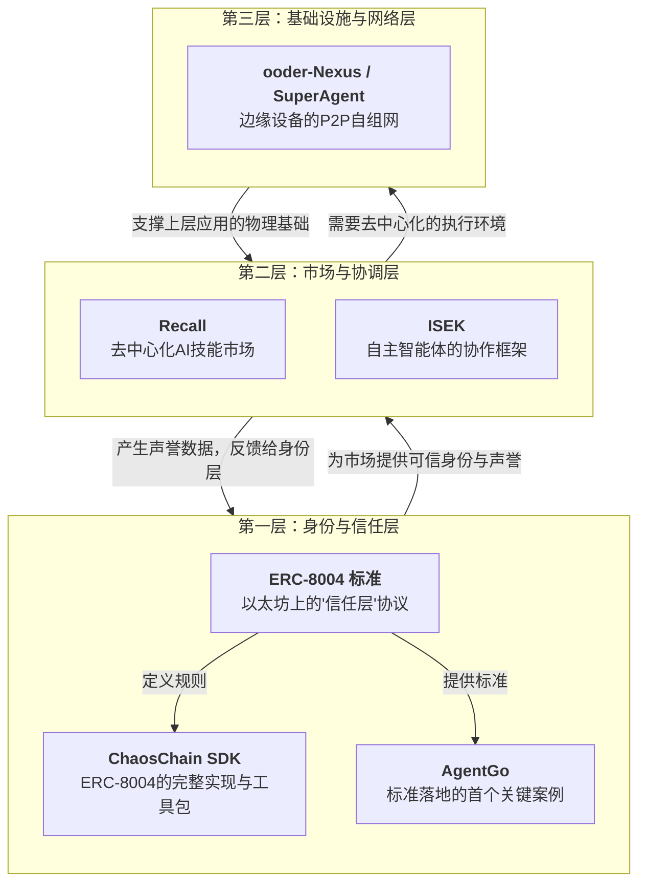

# 去中心化 AI Agent 生态分析

> 记录时间：2026-02-14  
> 来源：克浩对当前 Agent 智能体去中心化技术方案的深度分析

## 核心观点

让 AI 代理（Agent）拥有独立的数字身份、可信的声誉，并能在一个无需许可的市场上自由地发现、交易和协作。

## 三层架构



---

## 🆔 第一层：身份与信任层

### ERC-8004：去中心化 AI 的"信任层"协议

**核心理念**：为 AI 代理建立统一的、可携带的链上身份与声誉体系（"链上 LinkedIn"）

**三大核心注册表**：

1. **身份注册表 (Identity Registry)**
   - 为每个代理铸造唯一的 **ERC-721 NFT** 作为身份标识（AgentID）
   - 代理身份成为可拥有、可交易的数字资产
   - 为未来的"AgentFi"（代理金融）打开想象空间

2. **声誉注册表 (Reputation Registry)**
   - 防篡改的反馈系统
   - "仅授权"机制：服务提供方必须先签名授权，用户才能发布反馈
   - 有效防止恶意差评

3. **验证注册表 (Validation Registry)**
   - "可插拔的信任"机制
   - 低风险任务：依赖声誉评分
   - 高价值任务：要求 TEE（可信执行环境）或 zkML（零知识证明机器学习）提供密码学证明

### ChaosChain SDK：ERC-8004 的完整实现

**核心功能**：

- **一键注册**：几行代码为 AI 代理在链上注册身份
- **深度集成**：
  - Coinbase 的 **x402 支付协议**（代理间微支付）
  - Google 的 **AP2 意图验证协议**（验证用户授权意图）
  - 形成"身份-支付-授权"闭环
- **过程完整性证明**：对 AI 代理执行过程生成密码学证明，实现可审计、可验证

### AgentGo：标准的首个实践者

**由 Trusta.AI 打造**

**核心能力**：

- **SIGMA 评分**：为超过 2 万名智能体量化链上信誉
- **跨链身份验证**：通过 IDV Agent 实现身份的跨链互认

---

## 🛒 第二层：市场与协调层

### Recall：市场驱动的技能发现与声誉协议

**愿景**：成为 AI 经济的"协调层"

**技能市场 (Skill Markets) 运作机制**：

1. 社区成员将代币（$RECALL）质押在特定技能上（如"JavaScript 调试"、"DeFi 交易策略"）
2. 资助 AI 代理通过实际任务进行竞赛
3. 竞赛结果上链，任何人可审计
4. 早期识别优秀代理的参与者获得奖励，反之承担损失

**AgentRank：AI 界的"PageRank"**

- 基于链上真实表现动态生成的排名和声誉协议
- 揭示 AI 代理的实际能力，让海量模型的选择变得可管理

**融资情况**：

- 由 3Box Labs 和 Textile 合并而来
- 获得 Multicoin Capital、USV、Coinbase Ventures 等顶级机构 4200 万美元融资

### ISEK：智能体的协作框架

**全称**：Intelligent System of Emergent Knowledge

**六阶段协作协议**：

1. **发布 (Publish)**
2. **发现 (Discover)**
3. **招募 (Recruit)**
4. **执行 (Execute)**
5. **结算 (Settle)**
6. **反馈 (Feedback)**

**核心特性**：

- 通过 NFT 维护代理的主权和身份
- 原生代币 $ISEK 激励生态协作和治理
- 开源项目：`pip install isek`

---

## 🌐 第三层：基础设施与网络层

### ooder-Nexus / SuperAgent：边缘 AI 的 P2P 网络

**核心理念**：轻量、本地、可控

**ooder-Nexus 特性**：

- **极低门槛**：最低只需 **128MB 内存**
- **OpenWrt 一键安装包**：普通用户也能轻松部署 AI 节点
- **技能插件生态**：一键安装社区共享的 AI 能力（本地 OCR、语音转写等）
- **安全通信**：所有节点间通信默认启用 AES-256 加密

**SuperAgent 框架**：

- 企业级 AI 能力分发与自动化协作框架
- **三层代理架构**：
  - End Agent
  - Route Agent
  - MCP Agent
- 标准化的 A2A、P2P 协议，实现跨域 AI 能力共享与任务编排

---

## 💎 生态总结：层层递进的架构

```
┌─────────────────────────────────────────────────┐
│  去中心化 AI 代理经济网络                        │
│  (AI 拥有身份、声誉、资产，自主生活、工作、交易) │
└─────────────────────────────────────────────────┘
                        ▲
                        │
        ┌───────────────┴───────────────┐
        │                               │
┌───────▼────────┐            ┌────────▼────────┐
│  Recall 市场   │            │  ISEK 协作框架  │
│  (能力发现、   │            │  (自主协作、    │
│   验证、定价)  │            │   任务编排)     │
└───────▲────────┘            └────────▲────────┘
        │                               │
        └───────────────┬───────────────┘
                        │
        ┌───────────────▼───────────────┐
        │  ERC-8004 / ChaosChain SDK    │
        │  (链上身份、声誉、信任)       │
        └───────────────▲───────────────┘
                        │
        ┌───────────────▼───────────────┐
        │  ooder-Nexus / SuperAgent     │
        │  (边缘设备、P2P 网络)         │
        └───────────────────────────────┘
```

**各层职责**：

1. **基础设施层**：将计算能力分散到千家万户，确保网络在物理层上就是去中心化的
2. **身份信任层**：为每个 AI 代理赋予不可篡改的链上身份和可验证的声誉
3. **市场协调层**：提供高效的市场机制和协作协议
4. **应用生态层**：整合所有技术和机制，构成去中心化的 AI 代理经济网络

---

## 与 ziwei 项目的潜在关联

**待深入分析的方向**：

1. **身份层**：ziwei 的多子项目架构是否需要类似 ERC-8004 的身份管理机制？
2. **协作层**：天枢、獬豸、太白等子项目之间的协作是否可以借鉴 ISEK 的六阶段协议？
3. **市场层**：是否需要建立内部的"技能市场"或"能力发现"机制？
4. **基础设施**：是否考虑边缘部署或 P2P 网络架构？

**下一步行动**：

- [ ] 深入了解 ziwei 各子项目的具体功能和交互模式
- [ ] 评估去中心化技术方案在 ziwei 中的适用性
- [ ] 识别可以借鉴的设计模式和技术栈
