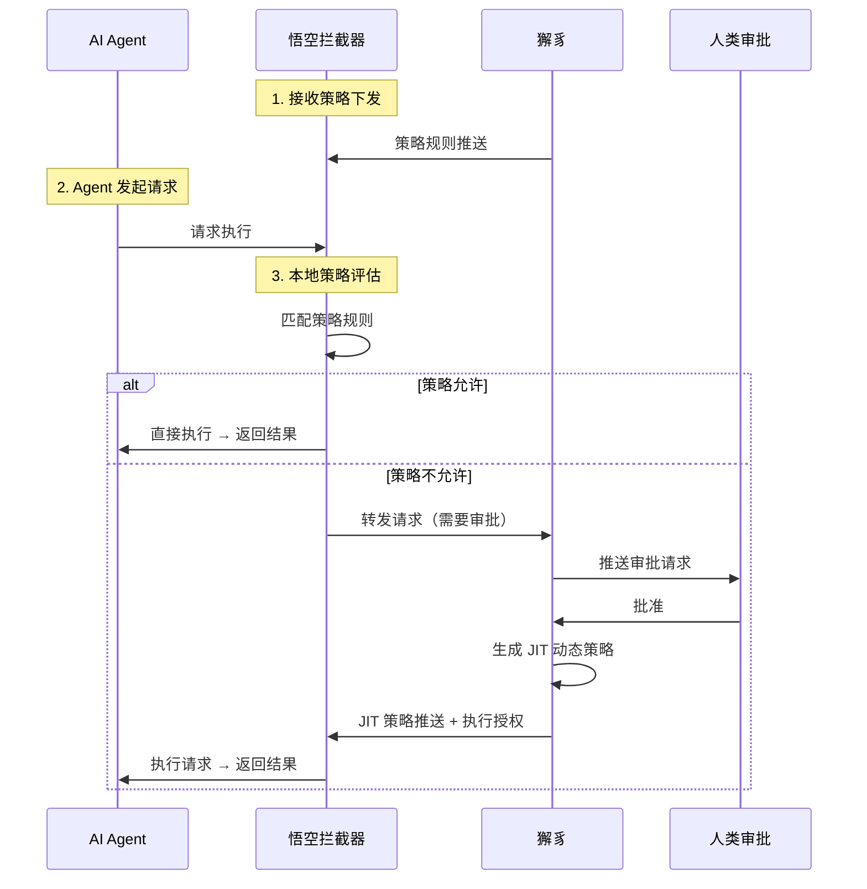

# 动态策略生命周期管理 - 提案

> 状态：讨论中
> 创建时间：2026-02-17

## 背景

静态策略引擎（如 Cedar/OPA 基础用法）主要解决的是"静态规则匹配"问题。但在实际 AI Agent 治理场景中，我们需要支持"申请-审批-生成-失效"的动态闭环。

本文档描述紫微系统如何实现"持续授权"（Continuous Authorization）模式，以及与悟空拦截器的配合。

---

## 一、核心概念：从"静态配置"转向"动态凭证"

### 传统模式 vs 动态授权模式

| 维度 | 传统静态策略 | 动态授权模式 |
|------|-------------|-------------|
| 策略更新 | 修改策略文件 | 动态生成凭证 |
| 时效性 | 永久/长期 | 临时（可设置过期时间） |
| 粒度 | 角色/资源级别 | 行级/列级范围 |
| 撤销方式 | 删除策略规则 | 删除凭证/等待过期 |
| 审计 | 策略变更审计 | 授权使用审计 |

### 适用场景

- AI Agent 需要访问特定客户数据（临时）
- 批量操作授权（一次性/时效性）
- 敏感表/字段的临时访问权
- 委托代理（人类委托 AI 代理执行）

---

## 二、架构设计

### 2.1 系统架构图

```
┌─────────────┐     ┌─────────────┐     ┌─────────────┐
│   AI Agent  │────▶│    悟空     │────▶│    獬豸     │
│  (DID 身份) │     │  (拦截器)   │     │ (策略+审批) │
└─────────────┘     └──────┬──────┘     └──────┬──────┘
                           │                    │
                           │ 策略内直接放行      │
                           │                    ▼
                           │            ┌─────────────┐
                           │            │   策略引擎   │
                           │            │  (OPA/Cedar)│
                           │            └──────┬──────┘
                           │                    │
                           │ 策略外             │
                           └──────────────────▶│
                                              │
                                              ▼
                                    ┌─────────────┐
                                    │ Matrix/飞书 │
                                    │ (审批界面)   │
                                    └─────────────┘
```

### 2.2 交互流程



---

## 三、JIT 动态策略

### 3.1 什么是 JIT 策略？

JIT（Just-In-Time）动态策略是审批通过后生成的临时授权凭证，具有以下特点：
- **临时性**：有明确的有效期
- **一次性**：通常只允许单次执行
- **细粒度**：可以精确到行级、列级
- **可追溯**：关联审批人和审批原因

### 3.2 策略模型

```json
{
  "type": "jit_policy",
  "policy_id": "jit-20260217-001",
  "subject": "did:ziwei:agent:ai-007",
  "scope": {
    "resource": "database:customers",
    "rows": "region='US'",
    "columns": ["name", "email"]
  },
  "actions": ["read", "export"],
  "issued_at": "2026-02-17T10:00:00Z",
  "expires_at": "2026-02-17T11:00:00Z",
  "context": {
    "approved_by": "did:human:alice",
    "reason": "季度数据清洗任务",
    "request_id": "cheq-xxx"
  }
}
```

### 3.3 字段说明

| 字段 | 类型 | 说明 |
|------|------|------|
| policy_id | string | 策略唯一标识 |
| subject | DID | 被授权的 Agent DID |
| scope.resource | string | 目标资源 |
| scope.rows | string | 行级过滤条件（SQL WHERE） |
| scope.columns | array | 允许访问的列 |
| actions | array | 允许的操作 |
| expires_at | timestamp | 过期时间 |
| context.approved_by | DID | 审批人 DID |
| context.request_id | string | 关联的 CHEQ ID |

---

## 四、悟空拦截器的角色

### 4.1 核心职责

| 职责 | 说明 |
|------|------|
| **策略接收** | 接收并存储獬豸下发的策略规则 |
| **本地评估** | 根据本地策略快速判断请求是否允许 |
| **策略内放行** | 请求在策略允许范围内，直接执行 |
| **策略外转发** | 请求超出策略范围，转发给獬豸 |
| **任务挂起** | 审批期间挂起任务，审批通过后执行 |
| **JIT 执行** | 收到 JIT 策略后执行被挂起的请求 |

### 4.2 本地策略评估

```
请求进入 → 提取上下文 → 匹配策略 → 返回决策
```

**决策结果**：
- **Allow**：策略允许，执行请求
- **Deny**：策略拒绝，返回错误
- **Review**：策略不明确，转发獬豸

### 4.3 任务挂起机制

当请求需要审批时，悟空执行以下操作：

1. **保存请求上下文**
   - 原始请求内容
   - 创建时间
   - 超时时间

2. **轮询审批状态**
   - 定期查询獬豸获取审批状态
   - 或通过 WebSocket 长连接接收推送

3. **审批通过后执行**
   - 接收 JIT 策略
   - 执行被挂起的请求
   - 清理挂起记录

---

## 五、生命周期管理

### 5.1 策略生命周期

```
┌─────────┐   审批通过    ┌─────────┐   执行完成    ┌─────────┐
│  待审批  │ ──────────▶ │  JIT 策略 │ ──────────▶ │ 已失效   │
└─────────┘              └─────────┘              └─────────┘
     ▲                        │                        │
     │      审批拒绝/超时      │                        │
     └────────────────────────┴────────────────────────┘
```

### 5.2 管理机制

| 阶段 | 操作 | 实现方式 |
|------|------|---------|
| 生成 | 人类审批通过后 | 獬豸生成 JIT 策略 |
| 下发 | 立即推送 | HTTP/WebSocket |
| 执行 | 审批通过后 | 悟空执行挂起任务 |
| 失效 | 过期自动清除 | 惰性检查 + 后台清理 |
| 撤销 | 主动撤销 | 删除策略记录 |

---

## 六、与现有系统的整合

### 6.1 与 CHEQ 的关系

```
CHEQ 审批通过 → 生成 JIT 策略 → 推送给悟空 → 执行挂起任务
```

CHEQ 审批通过后，生命周期管理器根据审批结果生成 JIT 动态策略。

### 6.2 与 OPA/Cedar 的整合

```rego
# OPA 策略示例：检查 JIT 策略
package system_authz

# 基础策略
allow {
    input.action == "read"
    input.principal.role == "agent"
}

# JIT 策略检查
allow {
    some grant in data.jit_policies
    grant.subject == input.principal.did
    grant.actions[_] == input.action
    time.now_ns() >= grant.issued_at_ns
    time.now_ns() < grant.expires_at_ns
}
```

---

## 七、选型建议

### 为什么选择 OPA 而非 Cedar？

| 特性 | OPA (Rego) | Cedar |
|------|-----------|-------|
| 策略与数据分离 | ✅ 原生支持 | ❌ 策略即代码 |
| 动态数据更新 | ✅ 支持 Bundle API 增量更新 | ❌ 需要重新部署 |
| 行级过滤 | ✅ 可在策略中返回 | ✅ 支持 |
| 社区生态 | ✅ 云原生标准 | 🔄 新兴 |
| 性能 | ✅ 高性能 | ✅ 高性能 |

**结论**：OPA 更适合"策略即数据"的动态授权模式。

---

## 八、开发任务

### Phase 1: 悟空拦截器

- [ ] 策略接收模块
- [ ] 本地策略评估引擎
- [ ] 任务挂起机制
- [ ] 轮询/长连接獬豸

### Phase 2: 獬豸端

- [ ] JIT 策略生成
- [ ] 策略下发推送
- [ ] OPA 集成

### Phase 3: 高级功能

- [ ] 行级过滤的 SQL 改写
- [ ] 策略缓存优化
- [ ] 监控告警

---

## 九、相关文档

- [网关拦截流程设计-提案.md](./网关拦截流程设计-提案.md)
- [Matrix端到端流程设计-提案.md](./Matrix端到端流程设计-提案.md)
- [CHEQ-IETF草案.md](../open/technical/CHEQ-IETF草案.md)
- [风险分析层技术方案-提案.md](./风险分析层技术方案-提案.md)
