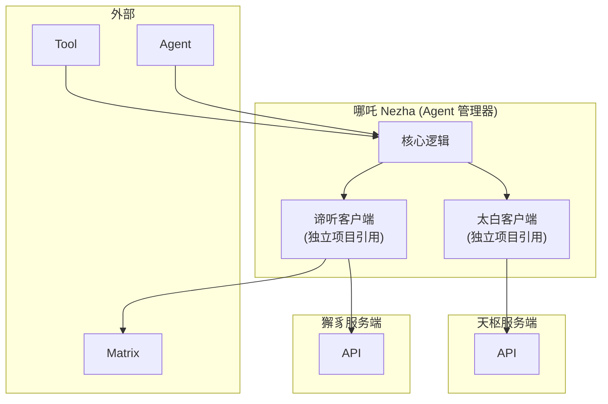
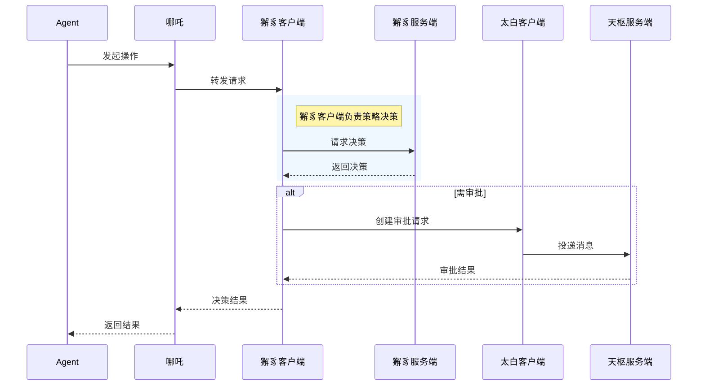

# 哪吒详细架构设计

## 1. 定位与职责

**定位**：哪吒是紫微系统的 Agent 生命周期管理器，集成在客户端环境。

**核心职责**：
- 集成**谛听**（独立项目 PEP 客户端）- 引用，无业务逻辑
- 集成**太白**（独立项目天枢客户端）- 引用，无业务逻辑
- Agent 生命周期管理
- 转发操作请求到谛听
- 执行决策结果

## 2. 架构图

## 3. 核心功能模块

| 模块 | 功能描述 |
|------|----------|
| 核心逻辑 | Agent 生命周期管理、请求转发 |
| 谛听客户端 | 独立项目 (ZiweiAxis/diting)，集成引用，无业务逻辑 |
| 太白客户端 | 独立项目 (ZiweiAxis/taibai)，集成引用，负责消息通讯 |

## 4. 工作流程时序图

## 5. 接口设计

| 接口 | 说明 |
|------|------|
| 与Agent | 接收操作请求 |
| 与谛听客户端 | 转发请求、接收决策 |
| 与太白客户端 | 消息投递请求 |
