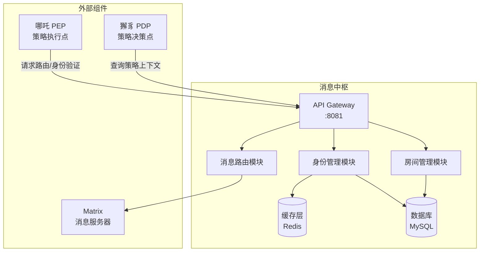
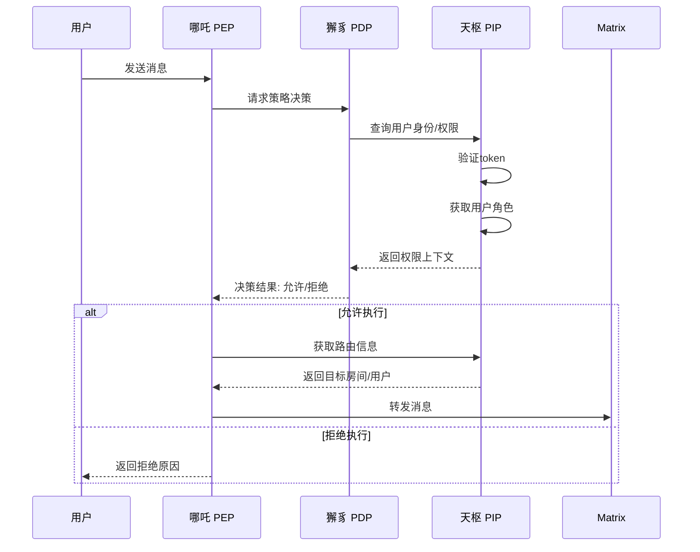
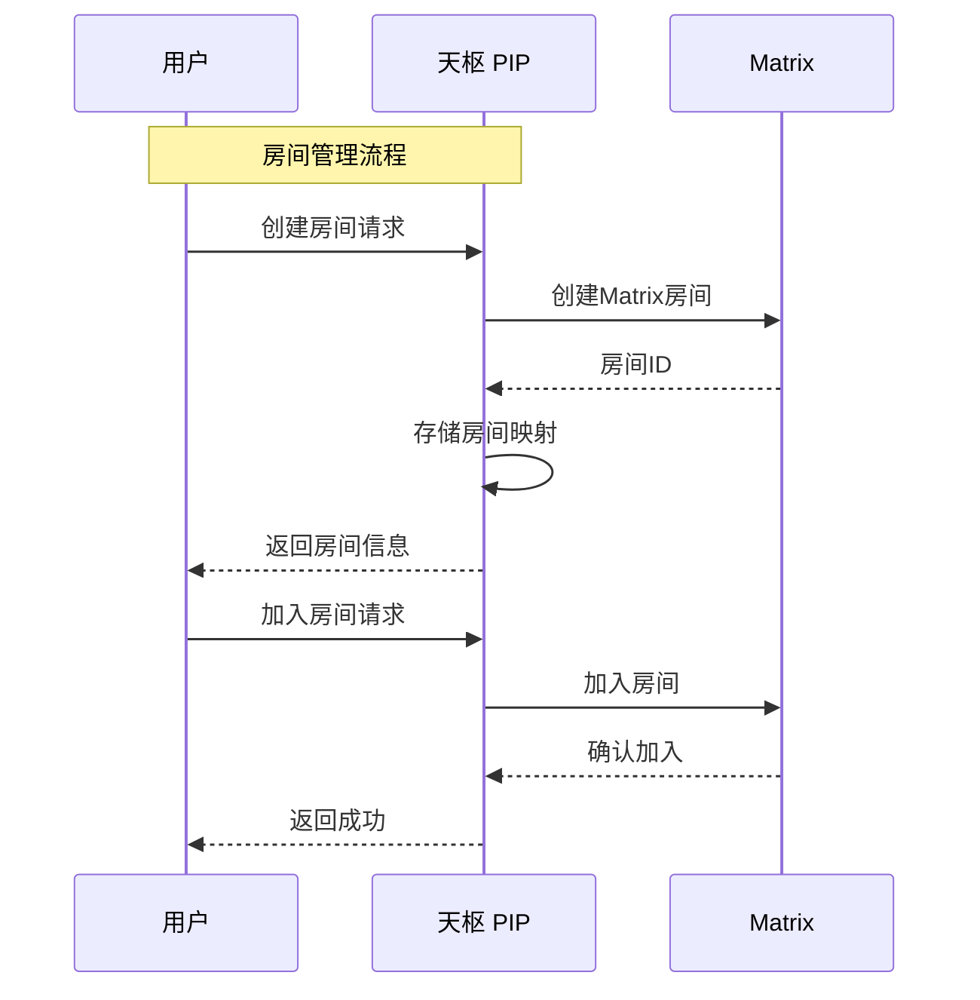
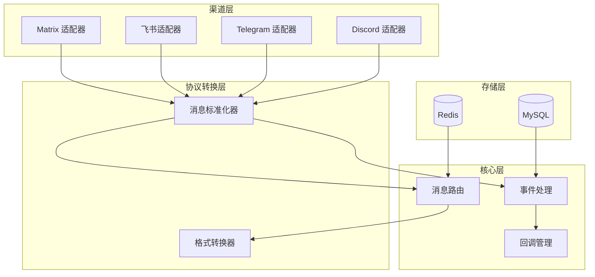
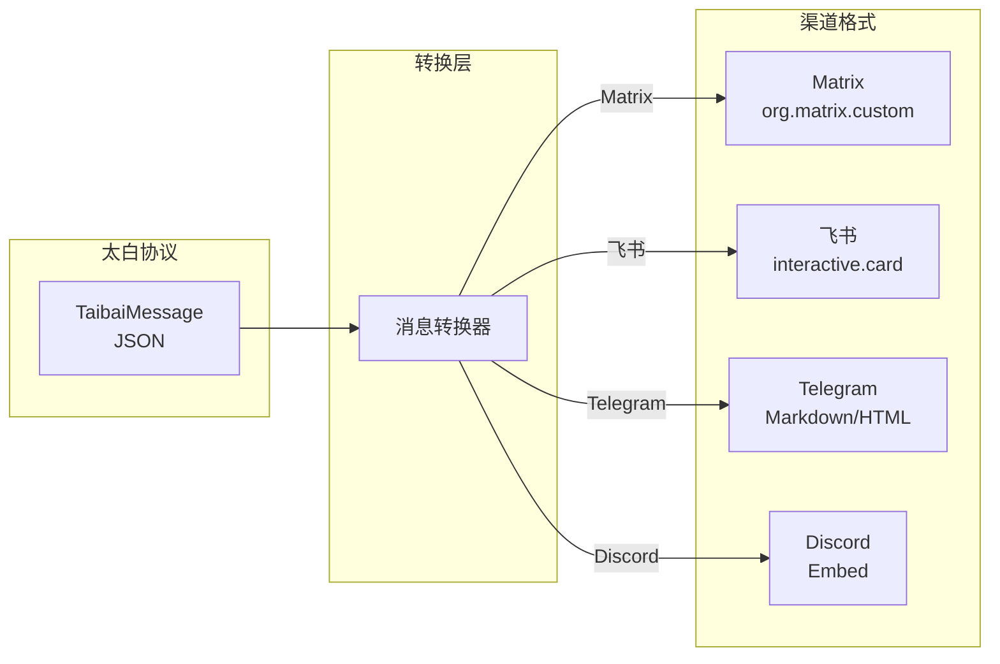
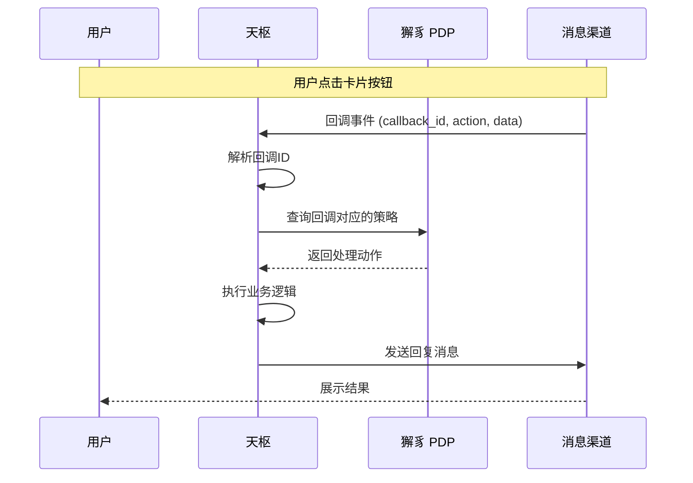
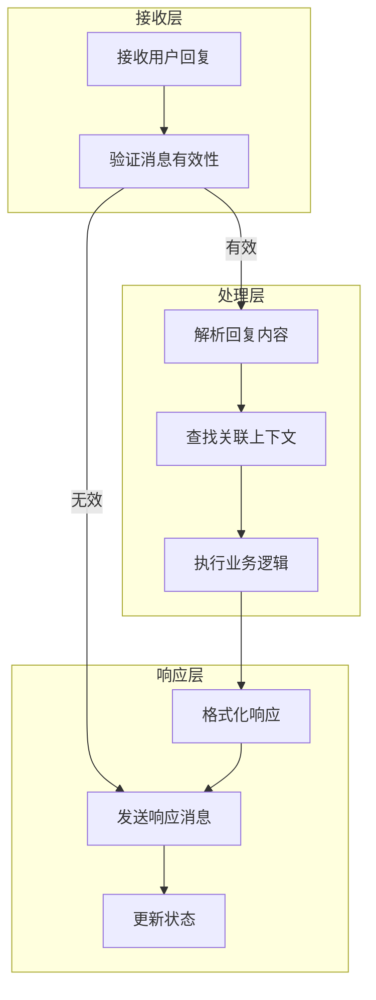
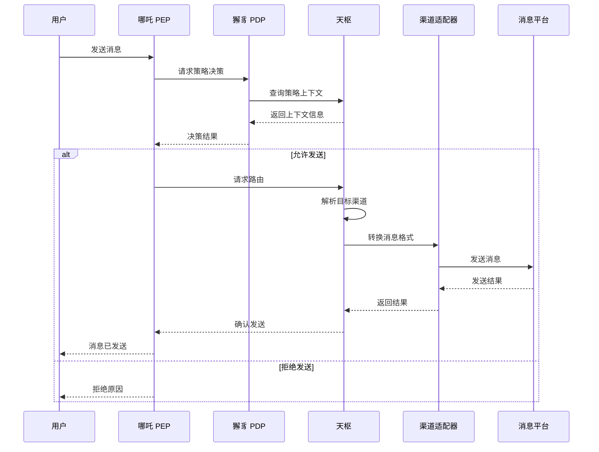
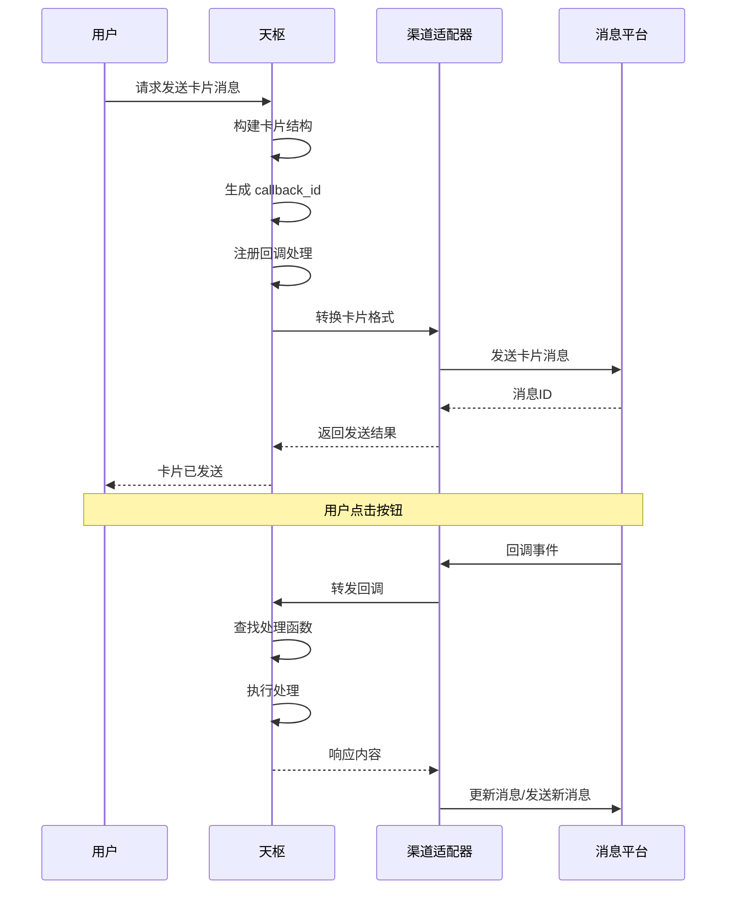

# 天枢详细设计文档

## 1. 定位与职责

**定位**：天枢是紫微系统的**消息中枢**，负责身份管理和消息投递（对接不同 IM 渠道）。

> 注：在与谛听交互时，天枢作为 PIP（策略信息点）提供策略上下文，但这不是天枢的核心职责。

**核心职责**：
- 用户身份认证与授权信息管理（Agent 注册、DID 管理）
- 消息投递，对接不同 IM 渠道 (Matrix/飞书/Telegram)
- 房间（Channel/群组）生命周期管理
- （仅在需要时）提供策略上下文信息给獬豸

## 2. 架构图



## 3. 核心功能模块

| 模块 | 功能描述 | 关键接口 |
|------|----------|----------|
| **身份管理** | 用户注册、认证、权限映射 | `getUserInfo`, `validateToken`, `getUserRoles` |
| **消息网关** | 消息分发到不同 IM 渠道 (Matrix/飞书/Telegram) | `routeMessage`, `resolveTarget`, `forwardMessage` |
| **房间管理** | 房间创建、成员管理、权限同步 | `createRoom`, `joinRoom`, `getRoomMembers`, `leaveRoom` |
| **策略上下文** | 为PDP提供决策所需上下文信息 | `getPolicyContext`, `queryUserPermissions` |

## 4. 工作流程时序图





## 5. 接口设计

### 身份管理

| 接口 | 方法 | 路径 | 说明 |
|------|------|------|------|
| 获取用户信息 | GET | `/api/v1/users/{userId}` | 查询用户基础信息 |
| 验证Token | POST | `/api/v1/auth/validate` | 验证访问令牌有效性 |
| 获取用户角色 | GET | `/api/v1/users/{userId}/roles` | 获取用户所有角色 |

### 消息路由

| 接口 | 方法 | 路径 | 说明 |
|------|------|------|------|
| 路由消息 | POST | `/api/v1/route` | 获取消息路由目标 |
| 解析目标 | POST | `/api/v1/route/resolve` | 解析用户名/房间名为Matrix ID |
| 转发消息 | POST | `/api/v1/message/forward` | 执行消息转发 |

### 房间管理

| 接口 | 方法 | 路径 | 说明 |
|------|------|------|------|
| 创建房间 | POST | `/api/v1/rooms` | 创建新房间 |
| 加入房间 | POST | `/api/v1/rooms/{roomId}/join` | 用户加入房间 |
| 离开房间 | POST | `/api/v1/rooms/{roomId}/leave` | 用户离开房间 |
| 获取成员 | GET | `/api/v1/rooms/{roomId}/members` | 获取房间成员列表 |

### 策略上下文

| 接口 | 方法 | 路径 | 说明 |
|------|------|------|------|
| 获取策略上下文 | GET | `/api/v1/policy/context` | 为PDP提供决策上下文 |
| 查询权限 | GET | `/api/v1/permissions/{userId}` | 查询用户权限列表 |

## 6. 多消息渠道架构

天枢支持多消息渠道接入，通过统一的适配器模式对接不同的即时通讯平台。

### 6.1 架构概述



### 6.2 渠道适配器

| 适配器 | 状态 | 说明 |
|--------|------|------|
| **Matrix** | ✅ 已支持 | 核心消息服务器，基于 Synapse |
| **飞书** | 🔄 开发中 | 支持企业内部群、单聊、卡片消息 |
| **Telegram** | 🔄 开发中 | 支持机器人API、频道、群组 |
| **Discord** | 📝 规划中 | 支持服务器、频道、Webhook |

### 6.3 适配器接口定义

```typescript
interface ChannelAdapter {
    // 发送消息
    sendMessage(target: string, message: Message): Promise<MessageResult>;
    
    // 发送卡片消息
    sendCard(target: string, card: CardMessage): Promise<MessageResult>;
    
    // 处理回调事件
    handleCallback(event: CallbackEvent): Promise<CallbackResult>;
    
    // 获取用户信息
    getUserInfo(userId: string): Promise<UserInfo>;
    
    // 消息格式化
    formatMessage(message: Message): any;
}
```

## 7. 消息协议转换

### 7.1 太白消息协议

太白是紫微系统的消息处理中心，使用统一的消息协议：

```typescript
interface TaibaiMessage {
    // 消息唯一ID
    messageId: string;
    
    // 发送者信息
    sender: {
        userId: string;
        username: string;
        platform: string;
    };
    
    // 接收者信息
    recipient: {
        type: 'user' | 'room' | 'channel';
        id: string;
    };
    
    // 消息内容
    content: {
        type: 'text' | 'image' | 'file' | 'card' | 'markdown';
        body: string;
        extra?: Record<string, any>;
    };
    
    // 消息元数据
    metadata: {
        timestamp: number;
        threadId?: string;
        replyTo?: string;
    };
    
    // 回调信息（用于卡片按钮）
    callback?: {
        callbackId: string;
        action: string;
        data: Record<string, any>;
    };
}
```

### 7.2 渠道消息格式转换



### 7.3 格式转换映射

| 内容类型 | Matrix | 飞书 | Telegram | Discord |
|----------|--------|------|----------|---------|
| 文本 | `org.matrix.custom.html` | `text` | Markdown | Embed description |
| 图片 | `m.image` | `image` | `photo` | Embed image |
| 卡片 | `org.matrix.custom.card` | `interactive.card` | Inline keyboard | Action row |
| Markdown | HTML 转换 | 富文本 | HTML | Markdown |

## 8. 消息回复逻辑

### 8.1 卡片按钮点击处理



### 8.2 用户回复处理流程



### 8.3 回调路由机制

```typescript
interface CallbackRouter {
    // 注册回调处理函数
    register(callbackId: string, handler: CallbackHandler): void;
    
    // 路由回调事件
    route(event: CallbackEvent): Promise<HandleResult>;
    
    // 回调超时处理
    handleTimeout(callbackId: string, data: any): void;
}

interface CallbackHandler {
    // 验证回调权限
    validate(event: CallbackEvent): Promise<boolean>;
    
    // 执行回调处理
    handle(event: CallbackEvent): Promise<HandleResult>;
    
    // 生成响应消息
    respond(result: HandleResult): Message;
}
```

### 8.4 回调超时配置

| 场景 | 超时时间 | 处理策略 |
|------|----------|----------|
| 卡片按钮点击 | 30秒 | 提示用户操作超时 |
| 消息回复 | 5分钟 | 释放关联上下文 |
| 菜单选择 | 60秒 | 提示请重新选择 |

## 9. 消息发送流程时序图

### 9.1 完整发送流程



### 9.2 卡片消息发送流程



---

## 10. WebSocket 接口

### 10.1 连接端点

| 端点 | 说明 |
|------|------|
| `/ws/stream` | 实时消息推送 |
| `/ws/events` | 事件推送（卡片回调、状态变更） |

### 10.2 消息格式

```json
{
    "type": "message",
    "payload": {
        "messageId": "msg-xxx",
        "content": {}
    }
}
```

### 10.3 心跳

- 客户端每 30 秒发送 ping
- 服务端响应 pong
- 超过 60 秒无活动断开连接

---

## 11. 错误码定义

### 11.1 通用错误码

| 错误码 | 说明 |
|--------|------|
| 400 | 请求参数错误 |
| 401 | 认证失败 |
| 403 | 权限不足 |
| 404 | 资源不存在 |
| 429 | 请求过于频繁 |
| 500 | 服务端错误 |
| 503 | 服务不可用 |

### 11.2 业务错误码

| 错误码 | 说明 |
|--------|------|
| 1001 | 用户不存在 |
| 1002 | 房间不存在 |
| 1003 | 消息发送失败 |
| 1004 | 回调超时 |
| 1005 | IM 渠道不可用 |

---

## 12. SDK 配置

### 12.1 服务地址配置

```yaml
tianshu:
  host: localhost
  port: 8081
  ws_port: 8082
  timeout: 30s
```

### 12.2 认证配置

```yaml
auth:
  type: bearer
  token: "your-token-here"
  refresh_enabled: true
```

---

## 13. 与太白 SDK 对照

| 功能 | 天枢服务端 | 太白 SDK |
|------|-----------|----------|
| 消息发送 | POST /api/v1/message/forward | SendMessage() |
| 用户查询 | GET /api/v1/users/{id} | GetUser() |
| 房间管理 | POST /api/v1/rooms | CreateRoom() |
| WebSocket | /ws/stream | Subscribe() |
| 错误码 | 通用 + 业务码 | ErrAuthFailed 等 |
