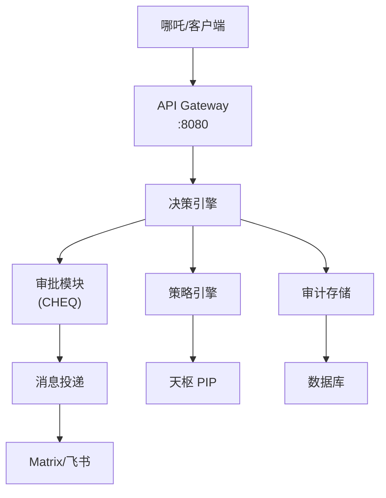
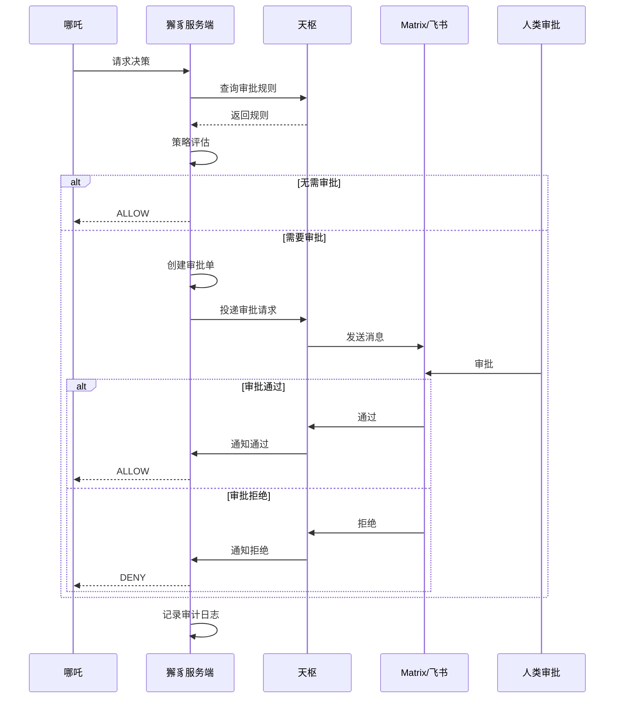
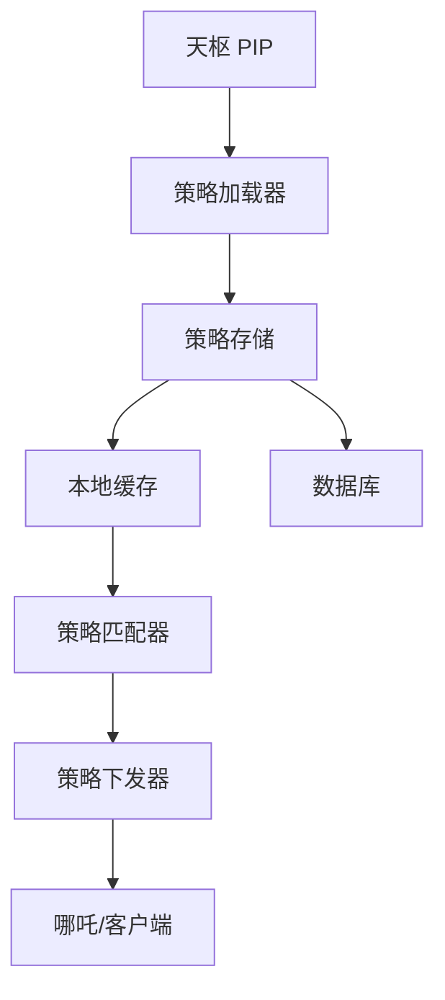
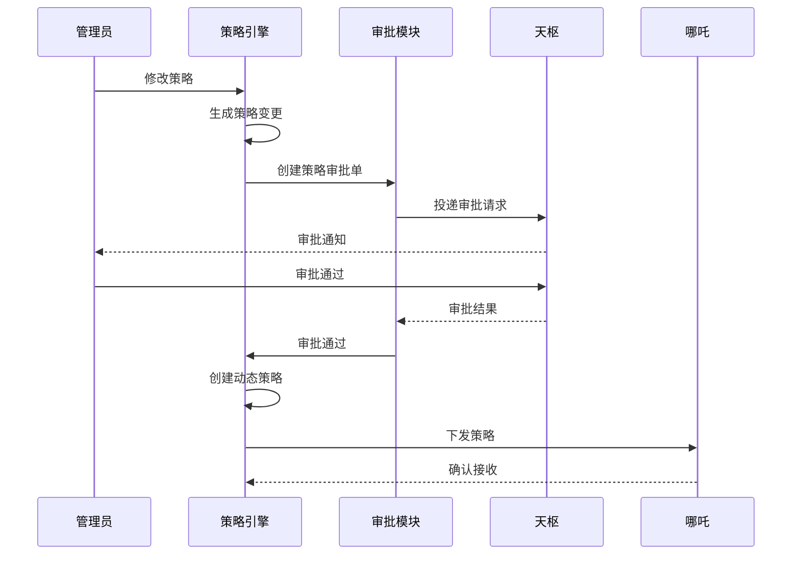
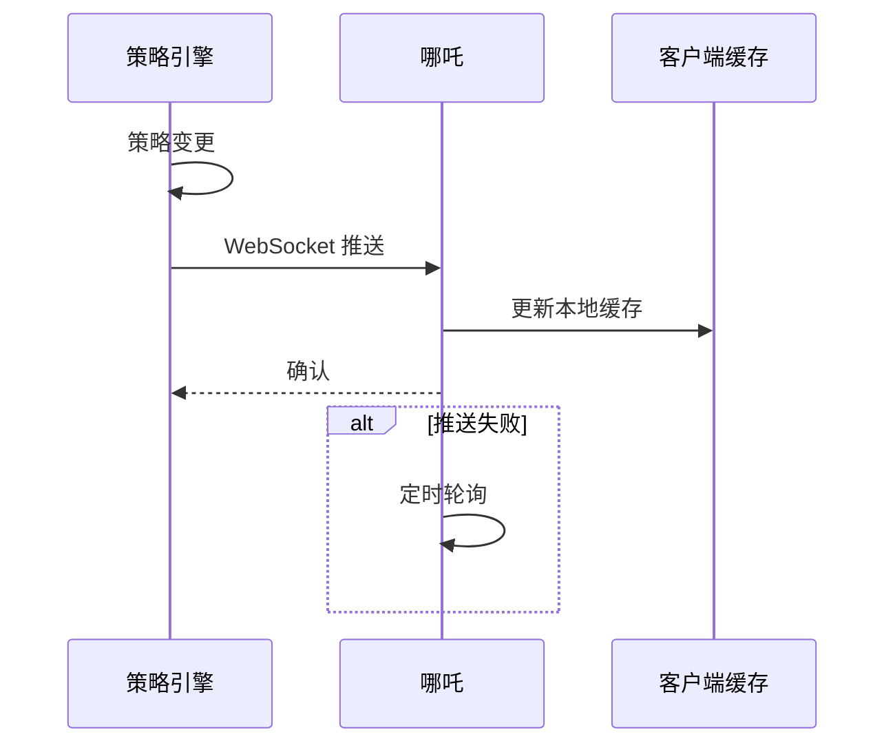

# 獬豸服务端详细设计

## PEP / PDP / PIP 概念

紫微系统基于 ABAC 模型，采用 PEP/PDP/PIP 架构：

| 角色 | 英文 | 说明 | 紫微组件 |
|------|------|------|----------|
| **PEP** | Policy Enforcement Point | 策略执行点 | 哪吒 (Nezha) |
| **PDP** | Policy Decision Point | 策略决策点 | 獬豸 (Xiezhi) |
| **PIP** | Policy Information Point | 策略信息点 | 天枢 + 业务系统 |

### 三者关系

```
用户请求 → PEP(哪吒) → PDP(獬豸) → PIP(天枢/业务系统)
```

**流程**：
1. PEP 拦截用户请求
2. PEP 向 PDP 发起决策请求
3. PDP 根据策略进行决策，向 PIP 查询属性
4. PDP 返回决策结果
5. PEP 执行决策

---

## 1. 定位与职责

**定位**：獬豸服务端是紫微系统的策略决策中心(PDP)和策略管理中心(PAP)。

**核心职责**：
- 策略管理与下发
- 策略决策
- 审批流程管理
- 审计日志存储
- 消息投递协调

## 2. 架构图



## 3. 核心功能模块

| 模块 | 功能描述 | 关键接口 |
|------|----------|----------|
| 策略引擎 | 策略的创建、存储、下发 | `createPolicy`, `getPolicy` |
| 决策引擎 | 接收请求，评估策略 | `/decide`, `/evaluate` |
| 审批模块 | CHEQ 审批单管理 | `createCheq`, `approve`, `reject` |
| 审计存储 | 操作日志记录 | `log`, `query` |
| 消息投递 | 协调消息发送 | `deliver`, `send` |

## 4. 工作流程时序图



## 5. 接口设计

### 决策接口

| 接口 | 方法 | 路径 | 说明 |
|------|------|------|------|
| 策略决策 | POST | `/api/v1/decide` | 请求策略决策 |
| 策略评估 | POST | `/api/v1/evaluate` | 评估请求 |

### 策略管理

| 接口 | 方法 | 路径 | 说明 |
|------|------|------|------|
| 创建策略 | POST | `/api/v1/policies` | 创建新策略 |
| 获取策略 | GET | `/api/v1/policies/{id}` | 获取策略详情 |
| 更新策略 | PUT | `/api/v1/policies/{id}` | 更新策略 |
| 删除策略 | DELETE | `/api/v1/policies/{id}` | 删除策略 |

### 审批管理

| 接口 | 方法 | 路径 | 说明 |
|------|------|------|------|
| 创建审批单 | POST | `/api/v1/cheq` | 创建审批单 |
| 审批 | POST | `/api/v1/cheq/{id}/approve` | 审批通过 |
| 审批 | POST | `/api/v1/cheq/{id}/reject` | 审批拒绝 |
| 查询审批单 | GET | `/api/v1/cheq/{id}` | 查询审批单状态 |

### 审计

| 接口 | 方法 | 路径 | 说明 |
|------|------|------|------|
| 记录日志 | POST | `/api/v1/audit` | 记录审计日志 |
| 查询日志 | GET | `/api/v1/audit` | 查询审计日志 |

## 6. 策略引擎详细设计

### 6.1 策略引擎架构



### 6.2 策略下发机制

1. **初始化加载**：服务启动时从数据库加载策略到内存
2. **热更新**：策略变更时实时推送到客户端
3. **定时同步**：定期全量同步策略到客户端

### 6.3 策略定义结构

```json
{
  "id": "policy-001",
  "name": "Agent注册审批",
  "version": "1.0",
  "rules": [
    {
      "condition": "action == 'agent.register'",
      "effect": "REVIEW"
    }
  ],
  "scope": {
    "business_system": "tianshu"
  }
}
```

### 6.4 策略审批流程



### 6.5 动态策略

审批通过后自动生成的策略：

```json
{
  "id": "dynamic-policy-xxx",
  "type": "DYNAMIC",
  "source": "approval-xxx",
  "rules": [...],
  "validity": {
    "start": "2026-01-01T00:00:00Z",
    "end": "2026-01-02T00:00:00Z"
  }
}
```

### 6.6 策略实时下发



### 6.7 策略接口扩展

| 接口 | 方法 | 路径 | 说明 |
|------|------|------|------|
| 加载策略 | POST | `/api/v1/policy/load` | 从天枢加载策略 |
| 下发策略 | POST | `/api/v1/policy/push` | 推送到客户端 |
| 创建动态策略 | POST | `/api/v1/policy/dynamic` | 创建动态策略 |
