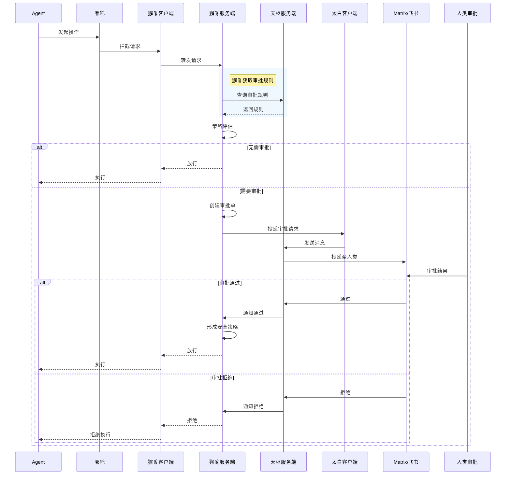

# 架构设计

# 紫微系统完整架构图

## 系统架构

```mermaid
flowchart TB
    subgraph Client["客户端环境"]
        Agent["Agent"]
        Tool["Tool"]
    end
    
    subgraph Nezha["哪吒 Nezha (PEP)"]
        NezhaCore["核心逻辑"]
        DClient["獬豸客户端"]
        TClient["太白客户端"]
    end
    
    subgraph Server["服务端"]
        Xiezhi["獬豸服务端<br/>(PDP+PAP)"]
        Tianshu["天枢服务端<br/>(PIP)"]
    end
    
    subgraph External["外部系统"]
        Matrix["Matrix"]
        Feishu["飞书"]
        DB["数据库"]
    end
    
    Agent --> NezhaCore
    Tool --> NezhaCore
    NezhaCore --> DClient
    NezhaCore --> TClient
    DClient --> Xiezhi
    TClient --> Tianshu
    Xiezhi &lt;--> Tianshu
    Xiezhi --> Matrix
    Xiezhi --> Feishu
    Tianshu --> DB
    Xiezhi --> DB
```

## 组件关系说明

### 哪吒 (Nezha) - 策略执行点 (PEP)
- 集成**谛听**（PEP 客户端）和**太白**（天枢客户端）
- Agent 生命周期管理
- 使用太白对接天枢（消息网关）
- 所有操作都会被谛听拦截（Agent、太白发出的请求）

### 谛听客户端 (Diting Client) - 独立子项目，集成在哪吒内部调用
- 拦截所有操作请求
- PEP (Policy Enforcement Point) - 獬豸的客户端
- 与獬豸服务端通信

### 太白客户端 (Taibai Client) - 独立子项目，集成在哪吒内部调用
- **天枢的客户端**
- **定义消息格式（太白消息协议）**
- 维护 Agent 状态（注册状态、DID 信息、当前状态）
- 与 Agent 统一的对话逻辑
- 消息投递渠道对接

### 獬豸服务端 (Xiezhi Server) - PDP + PAP
- **获取审批规则**（从业务系统如天枢）
- 策略评估
- 审批单创建与审批流程管理
- 审批通过后形成安全策略

### 天枢服务端 (Tianshu Server) - PIP (消息网关)
- 消息网关，消息分发到不同 IM 渠道 (Matrix/飞书/Telegram)
- 身份管理
- 房间管理
- 提供审批规则

## 审批规则获取流程



## 核心流程

### 1. 规则获取
```
哪吒 → 獬豸客户端 → 獬豸服务端 → 天枢(查询审批规则)
```

### 2. 审批流程
```
獬豸评估 → 需审批 → 创建审批单 → 太白→天枢→人类审批
                              ↓
                    审批通过 → 形成安全策略 → 放行
```

### 3. 安全策略
审批通过后形成的**安全策略**包含：
- 允许的操作范围
- 有效期
- 审批人信息
- 审计日志

---

> 注意：獬豸服务端自己发出的消息（如审批通知）不需要经过獬豸客户端拦截
