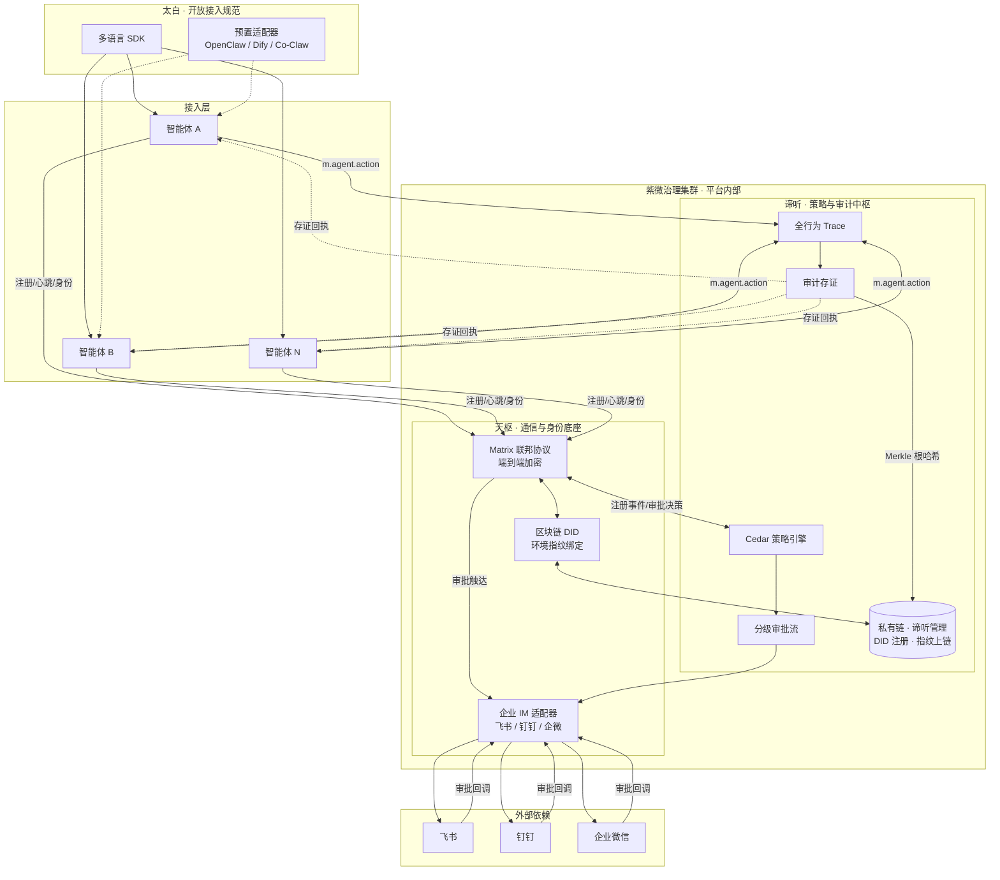

# 紫微智能体治理基础设施 技术方案

**版本**：v1.0  
**日期**：2026年2月  
**密级**：内部技术文档  

---

## 1. 总体架构

紫微平台采用**分层解耦、开放接入**的架构设计，由三个核心子系统构成：

| 子系统 | 职责 | 关键技术 |
|--------|------|----------|
| **天枢** | 智能体通信枢纽与身份控制平面 | Matrix 联邦协议、区块链 DID、环境指纹绑定、企业 IM 适配器 |
| **谛听** | 智能体授权决策与审计存证 | Cedar 策略引擎、分级审批流、全行为 Trace、链上存证 |
| **太白** | 智能体接入规范与生态集成 | Matrix 事件扩展、多语言 SDK、预置适配器 |

**架构原则**：
- **与运行时无关**：不侵入智能体执行逻辑，通过接口层治理。
- **与云厂商无关**：支持纯私有化部署，不依赖任何公有云服务。
- **可观测可验证**：所有操作关键指纹上链（默认私有链），审计日志密码学可验真。
- **联邦原生**：基于 Matrix 实现跨域智能体身份互信，天然支持多组织协作。

### 1.1 基础架构大图



*图 1：紫微智能体治理基础设施总体架构*

---

## 2. 天枢子系统：通信与身份底座

### 2.1 设计目标
- 为每个智能体提供**全局唯一、不可伪造**的数字身份。
- 作为所有人类-AI、AI-AI 通信的**可信路由枢纽**。
- 与企业现有 IM（飞书、钉钉、企业微信）无缝集成，作为审批触达通道。
- 消息传递**端到端加密**，且每条消息携带身份签名，接收方可实时验真。

### 2.2 身份模型

#### 2.2.1 区块链 DID
每个智能体在注册时，天枢生成一个符合 W3C DID 规范的去中心化标识符，并通过**谛听暴露的链上 DID 接口**完成注册与查询（天枢不直接运维链）。DID 文档写入**私有链**（默认方案；可选联盟链），包含：
- 公钥材料（用于签名验证）
- 环境指纹（见 2.2.2）
- 所有者信息（关联的企业用户 DID）
- 状态（激活/吊销）

**DID 生成算法**：`did:ziwei:<区块链标识>:<唯一哈希>`，唯一哈希由智能体公钥、注册时间戳、随机数组合后经 SHA3-256 生成。

#### 2.2.2 环境指纹绑定
为防止身份凭证被整体窃取后冒用，天枢将智能体的**部署环境特征**作为 DID 文档的必选属性上链。环境指纹由以下要素组合哈希生成：
- 硬件特征：CPU 序列号、主板 UUID、MAC 地址（容器环境则使用容器 ID）
- 软件特征：内核版本、Docker 镜像摘要、K8s Pod UID
- 网络特征：出口 IP 段、TLS 客户端证书指纹（如有）

智能体每次启动时需向天枢提交当前环境指纹，与链上记录比对。若不一致，则身份进入“待验证”状态，需人工审批方可恢复。

#### 2.2.3 企业身份联邦
天枢支持与企业现有身份源同步（规划中）：
- SCIM 协议：从 LDAP、Active Directory、飞书、钉钉、企业微信同步组织架构与用户属性。
- OIDC/OAuth2：支持企业 IdP 联邦认证，将员工身份映射为天枢内部用户 DID，并与智能体 DID 建立“拥有者”关系。

### 2.3 通信枢纽

天枢基于 **Matrix 协议** 实现联邦通信能力。Matrix 的以下特性与紫微高度契合：
- **端到端加密**：保障通信内容机密性。
- **联邦路由**：天然支持跨服务器、跨组织通信，无需中心化网关。
- **事件扩展**：可在标准事件基础上定义自定义事件类型，用于承载治理指令。

**紫微 Matrix 扩展事件**：
- `m.agent.register`：智能体注册请求
- `m.agent.identity`：身份下发与更新
- `m.agent.approval`：审批事件（用于 IM 机器人交互）
- `m.agent.action`：操作上报（由太白 SDK 生成）
- `m.agent.audit`：审计存证回执

所有事件均携带发送者的 DID 签名，接收方可通过链上 DID 文档验真。

### 2.4 企业 IM 集成
天枢内置适配器，将 Matrix 事件转换为各 IM 平台的消息格式，实现**审批触达**与**交互响应**：
- 飞书：通过飞书机器人推送审批卡片，用户点击后回调天枢 API。
- 钉钉：类似机制，支持钉钉内一键审批及生物识别验证。
- 企业微信：支持原生审批应用接入。

**交互流程**（以智能体注册为例）：
1. 智能体通过太白 SDK 向天枢发起注册请求（携带 owner 信息）。
2. 天枢解析 owner，向企业 IdP 查询确认身份，生成注册事件推送至谛听。
3. 谛听根据策略决策审批等级，通过天枢向审批人对应的 IM 终端发送审批卡片。
4. 审批人点击“通过”或拒绝，IM 平台回调天枢接口。
5. 若需生物识别，则调用 IM 平台的生物认证 SDK（如钉钉人脸、企业微信指纹）完成二次验证。
6. 审批结果返回谛听，决策通过后天枢生成 DID 并上链，将身份凭证下发智能体。

---

## 3. 谛听子系统：策略与审计中枢

### 3.1 设计目标
- 基于策略的**智能体注册与操作授权**决策。
- 支持**分级审批**（低风险一键通过，高风险生物识别）。
- **全行为 Trace**：录制智能体所有操作、通信、文件变更。
- **审计存证**：操作指纹实时上链，形成防篡改证据链。

### 3.2 策略引擎

谛听集成 **AWS Cedar** 作为核心策略语言与评估引擎。Cedar 具备以下优势：
- 专为 ABAC（基于属性的访问控制）设计，支持细粒度策略。
- 开源、云原生，性能优异（微秒级决策）。
- 已被 Ping Identity 等 IAM 厂商采用，生态成熟。

**策略模型**：
- 主体（Principal）：智能体 DID、用户 DID、角色
- 动作（Action）：`register`、`execute_command`、`read_file`、`call_api` 等
- 资源（Resource）：文件路径、API 端点、房间 ID 等
- 上下文（Context）：环境风险评分、时间、地理位置

**策略管理**：
- 提供 Web UI 进行策略编写、测试、版本控制。
- 策略变更需审批，历史版本可追溯。

### 3.3 分级审批流

谛听内置审批工作流引擎，根据策略决策结果自动触发不同等级的审批：

| 风险等级 | 判定依据 | 审批方式 | 存证要求 |
|---------|---------|---------|---------|
| **低风险** | 策略中 `require_approval = false`，且风险评分 < 30 | **一键通过**（仅记录审批人、时间） | 审批记录上链 |
| **中风险** | 策略 `require_approval = true`，风险评分 30-70 | **显式确认**（IM 卡片点击“允许”） | 审批记录上链 |
| **高风险** | 风险评分 ≥70，或涉及敏感资源 | **生物识别**（指纹/面容）+ 显式确认 | 审批记录 + 生物认证凭证上链 |

风险评分由谛听的**风控引擎**实时计算，基于行为基线、异常检测模型（规划中）。

### 3.4 全行为 Trace

谛听通过**钩子/适配器**模式从智能体采集操作日志，覆盖以下维度：

| 行为类型 | 采集方式 | 示例 |
|---------|--------|------|
| **文件操作** | 文件系统钩子（eBPF 或 SDK 埋点） | 读/写/删除/重命名 |
| **命令执行** | Shell 会话录制、子进程监控 | `rm -rf`、`curl` |
| **API 调用** | HTTP 流量镜像、SDK 拦截 | 调用内部 API、第三方服务 |
| **AI-AI 通信** | Matrix 事件监听 | 智能体间对话、工具调用 |
| **IM 交互** | 企业 IM 回调 | 机器人消息、审批操作 |

**Trace 数据模型**：
```json
{
  "trace_id": "uuid",
  "agent_did": "did:ziwei:...",
  "timestamp": 1707849600,
  "action_type": "file_write",
  "action_detail": {
    "path": "/etc/config.json",
    "size": 1024
  },
  "parent_trace_id": "关联的上层调用",
  "session_id": "会话标识"
}
```

### 3.5 审计存证上链

**核心机制**：**操作指纹上链，原数据本地存储**。

- 每条 Trace 记录生成 **SHA3-256 哈希**，连同 Trace ID、时间戳打包成 Merkle 树，将**树根哈希**定期写入区块链。
- 区块链**默认选用企业级私有链**，由**谛听子系统部署与管理**，同时承载天枢的 DID 注册与谛听的审计指纹上链；支持高 TPS、隐私保护。多机构场景可选用联盟链（如 Hyperledger Fabric、FISCO BCOS）。
- 验真工具：给定 Trace ID，系统可重构该记录所在 Merkle 路径，与链上根哈希比对，**3 秒内验证记录是否被篡改**。

**链上存证内容**（不含敏感数据）：
```
区块内容：
- 存证批次 ID
- Merkle 根哈希
- 批次起始/结束时间
- 签署节点 DID 签名
```

**优势**：
- 原始日志仍存储在本地或企业对象存储，满足大数据量检索需求。
- 链上仅存指纹，隐私合规，且任何单点篡改都会被链上根哈希锚定发现。
- 审计报告可直接附上链上交易 ID，具备司法级证明效力。

### 3.6 私有链子模块：位置与建设

**架构归属**：私有链是**谛听子系统内的子模块**。谛听部署、运维链节点，对外提供两类能力：**DID 链上服务**（注册/更新/查询 DID 文档）与**审计存证服务**（Merkle 根上链与验真）。天枢不部署链，仅调用谛听暴露的链上 DID 接口完成写链与查链。

**实现现状**：私有链在设计上归属谛听，在代码库中尚未落地。天枢（tianshu）当前无「调用链上 DID 注册/查询」实现；谛听（diting）当前无「私有链节点 + DID/存证上链」实现。建设时需在谛听内新建 chain 子模块，并由天枢通过接口调用。

**技术选型**：

| 场景 | 建议选型 | 说明 |
|------|----------|------|
| 默认私有链 | 轻量链 / 自研最小链 | 单机构、高 TPS，可先用「顺序日志 + 哈希链」或嵌入式键值 + Merkle 树实现，再对接标准链接口 |
| 需要标准链时 | Hyperledger Fabric / FISCO BCOS | 多节点、多机构 |
| 信创 | 长安链、FISCO BCOS 国产版 | 与 5.2 信创适配一致 |

建议一期在谛听内实现「链抽象层 + 最小可用私有链」（如基于 LevelDB/RocksDB 的追加日志 + Merkle 树），对外暴露 DID 服务 API 与存证/验真 API；二期再对接 Fabric/FISCO 等，实现可插拔链后端。

**当前项目目录结构（与本方案对应关系）**：

| 路径 | 角色 | 说明 |
|------|------|------|
| **ziwei/docs/** | 方案与图 | 技术方案、架构图 |
| **ziwei/tianshu/** | 天枢 | Python，`src/` 含 api、identity、storage、bridge、core、approval、registration、**diting_client**（通过环境变量调用谛听：DITING_INIT_PERMISSION_URL、DITING_AUDIT_URL 等） |
| **ziwei/diting/** | 谛听 | Go，`cmd/diting/` 为主程序，`internal/` 含 policy、delivery、ownership、audit、proxy、cheq；`pkg/` 含 dns、ebpf、waf。当前无链相关代码 |

**私有链在目录上的组织方式（二选一）**：

- **方式一（推荐）：链作为谛听仓库内子模块**  
  在 **diting** 内落链代码，与现有谛听同仓库、同语言（Go），由谛听服务暴露链 API 或独立进程部署。  
  - **diting/pkg/chain/** — 链核心：ledger 抽象、最小链实现（日志 + Merkle）、可选 Fabric 等适配；与 `pkg/dns`、`pkg/waf` 并列。  
  - **diting/cmd/diting/internal/chain/** — 若由 diting 主服务暴露：在此实现 `/chain/did/*`、`/chain/audit/*` 的路由与 handler，依赖 `pkg/chain`。  
  - **或 diting/cmd/chain/** — 若链独立进程：新建 `cmd/chain` 入口，单独监听端口、独立扩缩容，仍依赖 `pkg/chain`，部署时与 diting 同属谛听组件。  
  天枢通过既有「谛听基址」或新环境变量（如 `DITING_CHAIN_URL`）调用链上 DID 接口。

- **方式二：链作为仓库根下独立目录**  
  在 **ziwei** 根下与 tianshu、diting 并列新建 **ziwei/chain/**，可选用 Python/Go 等，独立实现 DID 注册/查询与存证/验真 API；部署与运维仍归属「谛听」体系（与谛听一起发布、同一团队运维）。  
  适用：希望链与谛听主程序解耦、不同语言或独立发布周期时。天枢通过独立配置（如 `CHAIN_API_URL`）调用。

**接口约定**（与上述任一目录方式兼容）：谛听（或 chain 服务）对天枢暴露：

- **DID 链上服务**：`POST /chain/did/register`（注册/更新 DID 文档），`GET /chain/did/{did}`（查询 DID 文档）。
- **审计存证服务**：`POST /chain/audit/batch`（按批次提交 Merkle 根与元数据，返回链上交易 ID），`GET /chain/audit/verify?trace_id=xxx`（根据 Trace ID 返回 Merkle 路径与链上根哈希，供验真）。

**建设阶段**：① 设计与接口（chain 目录、API 形态、链上数据格式）；② 最小链实现（ledger + api，可本地运行）；③ 谛听集成（Trace 落库后调用存证上链，注册流程调用 DID 注册）；④ 天枢对接（注册/心跳中调用谛听 DID 接口）；⑤ 可选对接 Fabric/FISCO/长安链 等标准链与信创。

---

## 4. 太白子系统：开放接入规范

### 4.1 设计目标
- 为各类智能体提供**统一的治理接入接口**。
- 降低集成门槛：**5 行代码**即可让智能体获得紫微身份与审计能力。
- 建立国内私有化智能体**事实上的治理标准**。

### 4.2 太白协议（基于 Matrix）

太白协议是在 Matrix 事件基础上定义的一组**强制实现**的事件接口：

| 事件类型 | 方向 | 用途 |
|---------|------|------|
| `m.agent.register_request` | 智能体 → 天枢 | 发起注册，携带 owner 信息、环境指纹 |
| `m.agent.identity` | 天枢 → 智能体 | 下发 DID 及凭证，包含私钥加密传输 |
| `m.agent.action` | 智能体 → 谛听 | 实时上报操作记录（低延迟） |
| `m.agent.audit` | 谛听 → 智能体 | 返回存证回执（包含链上交易 ID） |
| `m.agent.heartbeat` | 智能体 → 天枢 | 保活及环境指纹周期性校验 |
| `m.agent.revoke` | 天枢 → 智能体 | 吊销身份通知 |

所有事件负载均需使用智能体私钥签名，接收方通过链上 DID 公钥验签。

### 4.3 太白 SDK

太白提供多语言 SDK（Python、Go、Node.js、Java），封装以下能力：
- 自动注册与身份续期
- 操作日志打点与上报（支持同步/异步）
- 环境指纹采集
- 心跳维护
- 策略决策点查询（如“当前操作是否需要审批”）

**示例代码（Python）**：
```python
from ziwei import Agent

agent = Agent(
    owner="user@company.com",
    matrix_server="https://matrix.ziwei.local"
)
agent.register()  # 自动触发注册审批流程
agent.trace("file_write", path="/data/important.txt")
```

### 4.4 预置适配器

针对国内主流私有化智能体，太白提供**即插即用适配器**：

| 智能体 | 适配器实现方式 | 状态 |
|-------|--------------|------|
| **OpenClaw** | 插件形式，拦截其网关事件并转换为太白协议 | 已开发 |
| **中兴Co-Claw** | Skill SDK 扩展，内置谛听策略调用 | 联合开发 |
| **实在智能** | 通过 RPA 机器人监听器上报操作 | 联合开发 |
| **Dify** | 作为工具节点插件，通过 Matrix 与紫微通信 | 开发中 |

适配器开源，托管于紫微 GitHub 组织，采用 Apache 2.0 许可证。

---

## 5. 部署方案

### 5.1 私有化部署形态
紫微全系产品支持**纯私有化部署**，无任何强制公网依赖：

| 组件 | 部署方式 | 资源要求（最小） |
|------|--------|----------------|
| 天枢 | Docker / Kubernetes | 4核 8G |
| 谛听（含私有链节点，默认） | Docker / Kubernetes | 4核 8G |
| 企业 IdP 连接器 | Docker | 2核 4G |
| 太白 SDK | 嵌入智能体进程 | 无 |

**推荐架构**：
- 天枢与谛听（含其管理的私有链节点）组成**紫微治理集群**，企业内部部署（默认单链；多机构场景可选用联盟链）。
- 智能体集群可通过 Matrix 联邦协议与天枢通信，支持跨数据中心。
- 企业 IM 审批通道需内网穿透或专线对接（飞书/钉钉支持私有化部署版本）。

### 5.2 信创适配（规划中）
- 芯片：支持鲲鹏、飞腾、海光。
- 操作系统：麒麟、统信 UOS。
- 数据库：达梦、OceanBase（审计日志存储）。
- 区块链：长安链、FISCO BCOS 国产版本。

---

## 6. 关键技术指标

| 指标 | 目标值 | 测试环境 |
|------|-------|---------|
| 智能体身份注册延迟 | < 2秒（不含审批时间） | 内网 |
| 策略决策 P99 | < 10ms | Cedar 单机 |
| 操作上报端到端延迟 | < 100ms | 异步批处理 |
| 审计存证上链吞吐 | > 5000 TPS | Fabric 私有链 |
| 单集群支持智能体数量 | > 10万 | 水平扩展 |

---

## 7. 安全与合规

- **通信加密**：Matrix 端到端加密 + TLS 1.3。
- **私钥保护**：智能体私钥由天枢/太白 SDK 管理（注册时生成或注入密钥对、加密存储、按 DID 下发给智能体），支持 TPM/HSM 硬件保护；链上仅存公钥（DID 文档），不存私钥。与私有链（区块链）模块分开设计与实现。
- **数据脱敏**：Trace 记录支持正则匹配脱敏（身份证、银行卡、API Key）。
- **审计日志访问控制**：基于 DID 的细粒度权限，仅授权人员可查看原始 Trace。
- **合规认证**（规划）：ISO 27001、等保三级、商密认证。

---

**文档结束**
