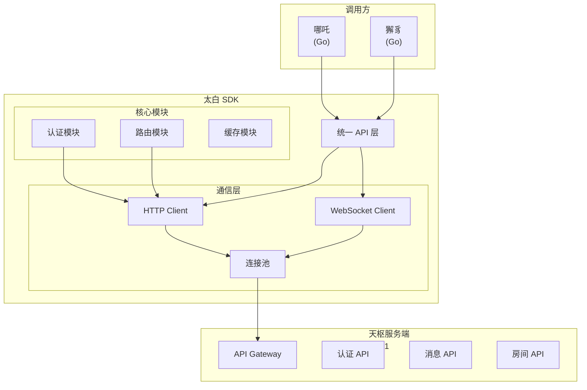
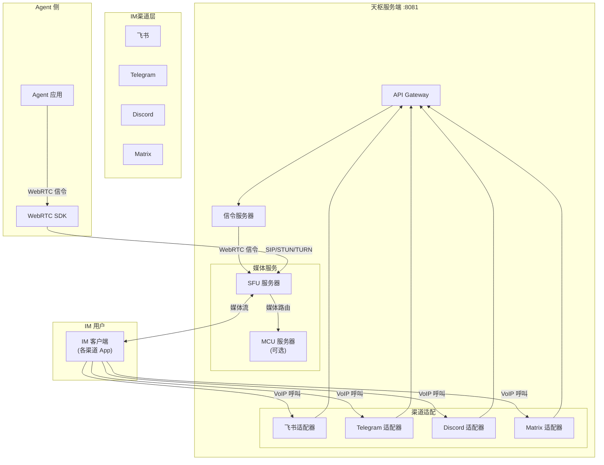
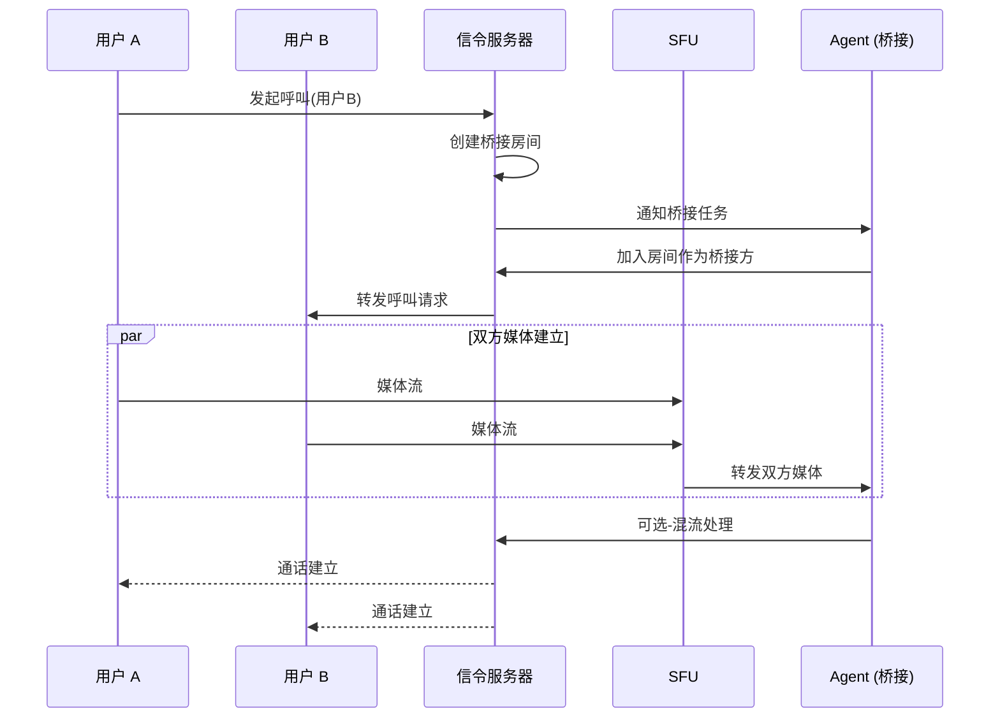
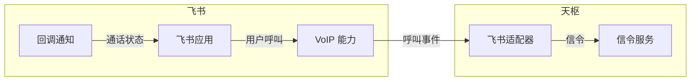

# 太白 SDK 详细设计方案

## 1. 概述

### 1.1 背景

紫微系统架构调整：
- **哪吒** 和 **獬豸** 都应该使用太白 SDK 调用天枢
- 不允许直接调用天枢 API
- 太白内部使用 HTTP 还是 WebSocket 是内部实现细节

### 1.2 设计目标

1. **统一通信层**：为哪吒和獬豸提供统一的天枢调用接口
2. **屏蔽实现细节**：调用方无需关心天枢通信方式（HTTP/WebSocket）
3. **多语言支持**：支持 Go、Python、JavaScript/Node.js
4. **可维护性**：SDK 独立演进，不影响业务代码

---

## 2. SDK 架构设计

### 2.1 整体架构



### 2.2 模块设计

| 模块 | 职责 | 说明 |
|------|------|------|
| **统一 API 层** | 对外提供简洁的调用接口 | 消息发送、接收、管理等 |
| **HTTP Client** | 处理 HTTP 请求 | RESTful API 调用 |
| **WebSocket Client** | 处理 WebSocket 连接 | 消息接收、事件推送 |
| **连接池** | 管理连接复用 | 高效网络通信 |
| **认证模块** | Token 管理 | 自动刷新、缓存 |
| **路由模块** | 消息路由解析 | 目标解析、格式转换 |
| **缓存模块** | 本地缓存 | 减少网络调用 |

### 2.3 核心设计原则

1. **接口隔离**：调用方只关心 API，不关心通信细节
2. **连接复用**：使用连接池提高性能
3. **自动重连**：WebSocket 断开自动重连
4. **错误重试**：失败请求自动重试（幂等操作）
5. **超时控制**：合理的超时和取消机制

---

## 3. 多语言实现方案

### 3.1 Go 实现

```go
// taibai-go 核心接口

package taibai

import (
    "context"
    "time"
)

// Client 天枢客户端接口
type Client interface {
    // 发送消息
    SendMessage(ctx context.Context, msg *Message) (*SendResult, error)
    
    // 接收消息（WebSocket）
    Subscribe(handler MessageHandler) error
    
    // 用户管理
    GetUser(ctx context.Context, userID string) (*User, error)
    GetUserRoles(ctx context.Context, userID string) ([]string, error)
    
    // 房间管理
    CreateRoom(ctx context.Context, req *CreateRoomRequest) (*Room, error)
    JoinRoom(ctx context.Context, roomID, userID string) error
    GetRoomMembers(ctx context.Context, roomID string) ([]*User, error)
    
    // 审批消息投递
    SendApprovalRequest(ctx context.Context, req *ApprovalRequest) (*ApprovalResult, error)
    
    // 关闭客户端
    Close() error
}

// Message 消息结构
type Message struct {
    MessageID  string
    Sender     string
    Recipient  Recipient
    Content    Content
    Timestamp  time.Time
    Metadata   map[string]interface{}
}

// Recipient 接收者
type Recipient struct {
    Type    string // "user", "room"
    ID      string
}

// Content 消息内容
type Content struct {
    Type    string // "text", "image", "file", "card", "markdown"
    Body    string
    Extra   map[string]interface{}
}

// MessageHandler 消息处理函数
type MessageHandler func(msg *Message) error
```

### 3.2 Python 实现

```python
# taibai-python 核心接口

from abc import ABC, abstractmethod
from dataclasses import dataclass
from typing import Optional, List, Callable, Dict, Any
from datetime import datetime
import asyncio

class Client(ABC):
    """天枢客户端"""
    
    @abstractmethod
    async def send_message(self, msg: "Message") -> "SendResult":
        """发送消息"""
        pass
    
    @abstractmethod
    async def subscribe(self, handler: Callable[["Message"], None]) -> None:
        """订阅消息（WebSocket）"""
        pass
    
    @abstractmethod
    async def get_user(self, user_id: str) -> "User":
        """获取用户信息"""
        pass
    
    @abstractmethod
    async def create_room(self, req: "CreateRoomRequest") -> "Room":
        """创建房间"""
        pass
    
    @abstractmethod
    async def close(self) -> None:
        """关闭客户端"""
        pass


@dataclass
class Message:
    message_id: str
    sender: str
    recipient: "Recipient"
    content: "Content"
    timestamp: datetime
    metadata: Dict[str, Any]


@dataclass
class Recipient:
    type: str  # "user", "room"
    id: str


@dataclass
class Content:
    type: str  # "text", "image", "file", "card", "markdown"
    body: str
    extra: Dict[str, Any]
```

### 3.3 JavaScript/Node.js 实现

```typescript
// taibai-js 核心接口

interface Client {
    // 发送消息
    sendMessage(msg: Message): Promise<SendResult>;
    
    // 接收消息（WebSocket）
    subscribe(handler: (msg: Message) => void): void;
    
    // 用户管理
    getUser(userId: string): Promise<User>;
    getUserRoles(userId: string): Promise<string[]>;
    
    // 房间管理
    createRoom(req: CreateRoomRequest): Promise<Room>;
    joinRoom(roomId: string, userId: string): Promise<void>;
    getRoomMembers(roomId: string): Promise<User[]>;
    
    // 审批消息投递
    sendApprovalRequest(req: ApprovalRequest): Promise<ApprovalResult>;
    
    // 关闭客户端
    close(): void;
}

interface Message {
    messageId: string;
    sender: string;
    recipient: Recipient;
    content: Content;
    timestamp: Date;
    metadata: Record<string, any>;
}

interface Recipient {
    type: 'user' | 'room';
    id: string;
}

interface Content {
    type: 'text' | 'image' | 'file' | 'card' | 'markdown';
    body: string;
    extra?: Record<string, any>;
}
```

---

## 4. API 接口定义

### 4.1 消息发送

| 接口 | 语言 | 方法 | 说明 |
|------|------|------|------|
| SendMessage | Go | `SendMessage(ctx, msg) (*SendResult, error)` | 发送消息 |
| send_message | Python | `async send_message(msg) -> SendResult` | 发送消息 |
| sendMessage | JS/TS | `sendMessage(msg: Message): Promise<SendResult>` | 发送消息 |

**请求示例**：

```go
// Go
msg := &taibai.Message{
    MessageID: uuid.New().String(),
    Sender: "agent-001",
    Recipient: taibai.Recipient{
        Type: "room",
        ID: "!abc123:xyin.oicp.net",
    },
    Content: taibai.Content{
        Type: "text",
        Body: "Hello from Agent",
    },
    Timestamp: time.Now(),
}
result, err := client.SendMessage(ctx, msg)
```

```python
# Python
msg = Message(
    message_id=str(uuid.uuid4()),
    sender="agent-001",
    recipient=Recipient(type="room", id="!abc123:xyin.oicp.net"),
    content=Content(type="text", body="Hello from Agent", extra={}),
    timestamp=datetime.now(),
    metadata={}
)
result = await client.send_message(msg)
```

```typescript
// TypeScript
const msg: Message = {
    messageId: crypto.randomUUID(),
    sender: 'agent-001',
    recipient: { type: 'room', id: '!abc123:xyin.oicp.net' },
    content: { type: 'text', body: 'Hello from Agent' },
    timestamp: new Date(),
    metadata: {}
};
const result = await client.sendMessage(msg);
```

### 4.2 消息接收（WebSocket）

| 接口 | 语言 | 方法 | 说明 |
|------|------|------|------|
| Subscribe | Go | `Subscribe(handler MessageHandler) error` | 订阅消息 |
| subscribe | Python | `async subscribe(handler: Callable)` | 订阅消息 |
| subscribe | JS/TS | `subscribe(handler: (msg: Message) => void): void` | 订阅消息 |

### 4.3 用户管理

| 接口 | 语言 | 方法 | 说明 |
|------|------|------|------|
| GetUser | Go | `GetUser(ctx, userID) (*User, error)` | 获取用户信息 |
| get_user | Python | `async get_user(user_id) -> User` | 获取用户信息 |
| getUser | JS/TS | `getUser(userId: string): Promise<User>` | 获取用户信息 |

| 接口 | 语言 | 方法 | 说明 |
|------|------|------|------|
| GetUserRoles | Go | `GetUserRoles(ctx, userID) ([]string, error)` | 获取用户角色 |
| get_user_roles | Python | `async get_user_roles(user_id) -> List[str]` | 获取用户角色 |
| getUserRoles | JS/TS | `getUserRoles(userId: string): Promise<string[]>` | 获取用户角色 |

### 4.4 房间管理

| 接口 | 语言 | 方法 | 说明 |
|------|------|------|------|
| CreateRoom | Go | `CreateRoom(ctx, req) (*Room, error)` | 创建房间 |
| create_room | Python | `async create_room(req) -> Room` | 创建房间 |
| createRoom | JS/TS | `createRoom(req: CreateRoomRequest): Promise<Room>` | 创建房间 |

| 接口 | 语言 | 方法 | 说明 |
|------|------|------|------|
| JoinRoom | Go | `JoinRoom(ctx, roomID, userID) error` | 加入房间 |
| join_room | Python | `async join_room(room_id, user_id)` | 加入房间 |
| joinRoom | JS/TS | `joinRoom(roomId: string, userId: string): Promise<void>` | 加入房间 |

| 接口 | 语言 | 方法 | 说明 |
|------|------|------|------|
| GetRoomMembers | Go | `GetRoomMembers(ctx, roomID) ([]*User, error)` | 获取房间成员 |
| get_room_members | Python | `async get_room_members(room_id) -> List[User]` | 获取房间成员 |
| getRoomMembers | JS/TS | `getRoomMembers(roomId: string): Promise<User[]>` | 获取房间成员 |

### 4.5 审批消息投递

| 接口 | 语言 | 方法 | 说明 |
|------|------|------|------|
| SendApprovalRequest | Go | `SendApprovalRequest(ctx, req) (*ApprovalResult, error)` | 投递审批请求 |
| send_approval_request | Python | `async send_approval_request(req) -> ApprovalResult` | 投递审批请求 |
| sendApprovalRequest | JS/TS | `sendApprovalRequest(req: ApprovalRequest): Promise<ApprovalResult>` | 投递审批请求 |

**审批请求结构**：

```go
// Go
type ApprovalRequest struct {
    RequestID    string                 // 请求ID
    Title        string                 // 审批标题
    Content      string                 // 审批内容
    Requester    string                 // 申请人
    Approvers    []string               // 审批人列表
    Priority     string                 // 优先级: low, normal, high, urgent
    CallbackURL  string                 // 回调地址
    Metadata     map[string]interface{} // 扩展元数据
}
```

---

## 5. 哪吒和獬豸的使用方式

### 5.1 哪吒使用太白 SDK（Go）

```go
package nezha

import (
    "context"
    "taibai-sdk-go"
)

type MessageService struct {
    client *taibai.Client
}

func NewMessageService(endpoint, token string) (*MessageService, error) {
    client, err := taibai.NewClient(taibai.Config{
        Endpoint: endpoint,
        Token:    token,
        // 可选：配置 WebSocket
        WebSocket: taibai.WebSocketConfig{
            Enabled:    true,
            Reconnect: true,
        },
    })
    if err != nil {
        return nil, err
    }
    
    return &MessageService{client: client}, nil
}

func (s *MessageService) SendToRoom(ctx context.Context, roomID, content string) error {
    msg := &taibai.Message{
        MessageID: uuid.New().String(),
        Sender:    "nezha-agent",
        Recipient: taibai.Recipient{
            Type: "room",
            ID:   roomID,
        },
        Content: taibai.Content{
            Type: "text",
            Body: content,
        },
        Timestamp: time.Now(),
    }
    
    _, err := s.client.SendMessage(ctx, msg)
    return err
}

func (s *MessageService) SubscribeMessages(handler func(msg *taibai.Message) error) error {
    return s.client.Subscribe(handler)
}
```

### 5.2 獬豸使用太白 SDK 投递审批消息（Go）

```go
package xiezhi

import (
    "context"
    "taibai-sdk-go"
)

type ApprovalService struct {
    client *taibai.Client
}

func NewApprovalService(endpoint, token string) (*ApprovalService, error) {
    client, err := taibai.NewClient(taibai.Config{
        Endpoint: endpoint,
        Token:    token,
    })
    if err != nil {
        return nil, err
    }
    
    return &ApprovalService{client: client}, nil
}

func (s *ApprovalService) RequestApproval(ctx context.Context, req *ApprovalRequest) (*ApprovalResult, error) {
    // 构建审批消息
    approvalReq := &taibai.ApprovalRequest{
        RequestID:   req.ID,
        Title:       req.Title,
        Content:     req.Content,
        Requester:   req.Requester,
        Approvers:   req.Approvers,
        Priority:    req.Priority,
        CallbackURL: s.getCallbackURL(req.ID),
        Metadata: map[string]interface{}{
            "action":      req.Action,
            "resource":    req.Resource,
            "expired_at":  req.ExpiredAt,
        },
    }
    
    // 发送审批请求
    return s.client.SendApprovalRequest(ctx, approvalReq)
}

func (s *ApprovalService) HandleApprovalCallback(approvalID string, approved bool, approver string) error {
    // 处理审批回调
    // 更新审批状态、通知相关方
}
```

### 5.3 完整使用示例

```go
// 完整示例：哪吒发送消息并监听审批结果

package main

import (
    "context"
    "fmt"
    "log"
    "taibai-sdk-go"
)

func main() {
    // 1. 初始化客户端
    client, err := taibai.NewClient(taibai.Config{
        Endpoint: "http://tianshu:8081",
        Token:   "your-auth-token",
        WebSocket: taibai.WebSocketConfig{
            Enabled:    true,
            Reconnect:  true,
        },
    })
    if err != nil {
        log.Fatal(err)
    }
    defer client.Close()
    
    ctx := context.Background()
    
    // 2. 发送消息到房间
    msg := &taibai.Message{
        MessageID: "msg-001",
        Sender:    "nezha",
        Recipient: taibai.Recipient{
            Type: "room",
            ID:   "!room123:xyin.oicp.net",
        },
        Content: taibai.Content{
            Type: "text",
            Body: "系统消息：任务开始执行",
        },
    }
    
    result, err := client.SendMessage(ctx, msg)
    if err != nil {
        log.Printf("发送失败: %v", err)
        return
    }
    fmt.Printf("消息发送成功: %s\n", result.MessageID)
    
    // 3. 订阅接收消息
    err = client.Subscribe(func(msg *taibai.Message) error {
        fmt.Printf("收到消息: %s\n", msg.Content.Body)
        return nil
    })
    if err != nil {
        log.Printf("订阅失败: %v", err)
    }
}
```

---

## 6. 与直接调用天枢的区别

### 6.1 架构对比

| 维度 | 直接调用天枢 API | 使用太白 SDK |
|------|-----------------|--------------|
| **调用方式** | 直接 HTTP 请求 | 统一的 SDK 接口 |
| **连接管理** | 每次请求新建连接 | 连接池复用 |
| **认证** | 手动管理 Token | 自动 Token 刷新 |
| **错误处理** | 各自实现 | 统一的重试、超时机制 |
| **消息接收** | 轮询或自行实现 WebSocket | 内置 WebSocket 支持 |
| **维护性** | API 变更需要修改多处 | SDK 升级即可 |

### 6.2 代码复杂度对比

**直接调用天枢（现状）**：

```go
// 哪吒直接调用天枢 - 需要自己处理
func sendMessageToRoom(roomID, content string) error {
    // 1. 手动构建请求
    req := map[string]interface{}{
        "room_id":  roomID,
        "content":  content,
        "sender":   "nezha",
    }
    
    // 2. 手动添加认证
    token, err := getToken()
    if err != nil {
        return err
    }
    
    // 3. 手动发送 HTTP 请求
    resp, err := http.Post(
        "http://tianshu:8081/api/v1/message/send",
        "application/json",
        marshal(req),
        "Authorization", "Bearer "+token,
    )
    // 4. 手动处理响应
    // 5. 手动处理重试
    // 6. 手动处理超时
}
```

**使用太白 SDK**：

```go
// 使用太白 SDK
func sendMessage(client *taibai.Client, roomID, content string) error {
    msg := &taibai.Message{
        Sender:    "nezha",
        Recipient: taibai.Recipient{Type: "room", ID: roomID},
        Content:   taibai.Content{Type: "text", Body: content},
    }
    _, err := client.SendMessage(context.Background(), msg)
    return err
}
```

### 6.3 功能差异

| 功能 | 直接调用 | 太白 SDK |
|------|----------|----------|
| 消息发送 | ✅ | ✅ |
| 消息接收 | 需自行实现 WebSocket | ✅ 内置 |
| 用户查询 | ✅ | ✅ |
| 房间管理 | ✅ | ✅ |
| 审批投递 | 需自行构建消息 | ✅ 专用接口 |
| Token 自动刷新 | 需自行实现 | ✅ |
| 连接池 | 需自行实现 | ✅ |
| 自动重连 | 需自行实现 | ✅ |
| 请求重试 | 需自行实现 | ✅ |
| 统一日志 | 各自实现 | ✅ 统一格式 |

### 6.4 为什么需要太白 SDK

1. **封装复杂度**：将 HTTP/WebSocket、认证、重连等复杂逻辑封装
2. **统一接口**：为不同语言调用方提供一致体验
3. **可测试性**：SDK 可独立测试和演进
4. **故障隔离**：天枢 API 变更只需要升级 SDK
5. **最佳实践**：内置连接池、重试、缓存等最佳实践

---

## 7. 配置与初始化

### 7.1 配置结构

```go
type Config struct {
    // 天枢服务端地址
    Endpoint string
    
    // 认证 Token
    Token string
    
    // 超时配置
    Timeout time.Duration
    
    // WebSocket 配置
    WebSocket WebSocketConfig
    
    // 连接池配置
    Pool PoolConfig
    
    // 缓存配置
    Cache CacheConfig
}

type WebSocketConfig struct {
    Enabled    bool
    Reconnect  bool
    MaxRetries int
}

type PoolConfig struct {
    MaxIdle    int
    MaxActive  int
    IdleTimeout time.Duration
}

type CacheConfig struct {
    Enabled bool
    TTL     time.Duration
}
```

### 7.2 初始化示例

```go
// Go
client, err := taibai.NewClient(taibai.Config{
    Endpoint: "http://tianshu:8081",
    Token:    "your-token",
    Timeout:  30 * time.Second,
    WebSocket: taibai.WebSocketConfig{
        Enabled:   true,
        Reconnect: true,
    },
})
```

```python
# Python
client = TaibaiClient(
    endpoint="http://tianshu:8081",
    token="your-token",
    timeout=30,
    websocket_enabled=True
)
```

```typescript
// TypeScript
const client = new TaibaiClient({
    endpoint: 'http://tianshu:8081',
    token: 'your-token',
    timeout: 30000,
    websocket: {
        enabled: true,
        reconnect: true
    }
});
```

---

## 8. 错误处理

### 8.1 错误类型

```go
// Go 错误类型
var (
    ErrAuthFailed      = errors.New("authentication failed")
    ErrInvalidToken    = errors.New("invalid token")
    ErrNetworkError    = errors.New("network error")
    ErrTimeout         = errors.New("request timeout")
    ErrServerError     = errors.New("server error")
    ErrWebSocketClose  = errors.New("websocket closed")
)
```

### 8.2 重试策略

| 错误类型 | 重试策略 |
|----------|----------|
| 网络错误 | 指数退避重试，最多重试 3 次 |
| 超时 | 重试 1 次 |
| 5xx 错误 | 指数退避重试，最多重试 3 次 |
| 401 认证失败 | 刷新 Token 后重试 |
| 4xx 错误 | 不重试，返回错误 |

---

## 9. 监控与日志

### 9.1 关键指标

| 指标 | 说明 |
|------|------|
| 请求延迟 | API 调用耗时 |
| 请求成功率 | 成功请求 / 总请求 |
| WebSocket 连接数 | 当前活跃连接数 |
| Token 刷新次数 | Token 刷新频率 |

### 9.2 日志级别

| 级别 | 说明 |
|------|------|
| DEBUG | 详细调试信息 |
| INFO | 正常运行时信息 |
| WARN | 警告信息 |
| ERROR | 错误信息 |

---

## 10. 天枢与太白通讯方案分析

### 10.1 通讯方式分类

根据业务场景，天枢与太白之间的通讯分为以下几类：

| 通讯类型 | 方向 | 场景 | 推荐协议 |
|----------|------|------|----------|
| **API 调用** | 太白 → 天枢 | 消息发送、用户查询、房间管理 | HTTP/1.1 或 HTTP/2 |
| **消息接收** | 天枢 → 太白 | 实时消息推送、卡片回调通知 | WebSocket |
| **事件推送** | 天枢 → 太白 | 策略变更通知、状态同步 | WebSocket |
| **审批流转** | 太白 → 天枢 → 太白 | 审批请求投递、审批结果回调 | HTTP + WebSocket |

### 10.2 协议选择

#### 10.2.1 HTTP vs WebSocket 对比

| 特性 | HTTP | WebSocket |
|------|------|-----------|
| **连接方式** | 短连接，每次请求新建 | 长连接，双向通信 |
| **实时性** | 轮询/Server-Sent Events | 真正的实时推送 |
| **资源消耗** | 每次请求有开销 | 连接建立后低开销 |
| **适用场景** | 请求-响应模式 | 事件驱动模式 |
| **防火墙** | 通常无障碍 | 可能被阻止 |

#### 10.2.2 建议方案

```
┌─────────────────────────────────────────────────────────────────┐
│                        太白 SDK 通讯架构                         │
├─────────────────────────────────────────────────────────────────┤
│                                                                 │
│   ┌──────────┐                              ┌──────────┐      │
│   │   哪吒   │                              │   獬豸   │      │
│   └────┬─────┘                              └────┬─────┘      │
│        │                                         │             │
│        │  ┌──────────────────────────────────────┘             │
│        │  │                                                        │
│        ▼  ▼                                                        │
│   ┌─────────────────────────────────────────────────────┐        │
│   │                  太白 SDK                            │        │
│   │  ┌─────────────────┐    ┌─────────────────────────┐ │        │
│   │  │   HTTP Client  │    │    WebSocket Client     │ │        │
│   │  │                 │    │                          │ │        │
│   │  │ • 消息发送      │    │  • 消息接收              │ │        │
│   │  │ • 用户查询      │    │  • 卡片回调              │ │        │
│   │  │ • 房间管理      │    │  • 事件推送              │ │        │
│   │  │ • 审批投递      │    │  • 策略下发              │ │        │
│   │  └────────┬────────┘    └───────────┬─────────────┘ │        │
│   │           │                          │               │        │
│   │           └──────────┬───────────────┘               │        │
│   │                      │                               │        │
│   │              ┌───────▼───────┐                       │        │
│   │              │   连接池      │                       │        │
│   │              │   自动重连    │                       │        │
│   │              │   错误重试    │                       │        │
│   │              └───────┬───────┘                       │        │
│   └──────────────────────┼───────────────────────────────┘        │
│                          │                                        │
└──────────────────────────┼────────────────────────────────────────┘
                           │
                           ▼
              ┌────────────────────────┐
              │      天枢服务端        │
              │        :8081           │
              │                        │
              │  ┌──────────────────┐  │
              │  │   REST API       │  │
              │  │   (HTTP)         │  │
              │  └──────────────────┘  │
              │  ┌──────────────────┐  │
              │  │   WebSocket      │  │
              │  │   Server          │  │
              │  └──────────────────┘  │
              └────────────────────────┘
```

**协议选择结论**：

1. **HTTP 作为主通道**：
   - 消息发送、用户查询、房间管理等请求-响应场景
   - 使用 HTTP/1.1 Keep-Alive + 连接池优化性能
   - 支持未来升级到 HTTP/2 多路复用

2. **WebSocket 作为辅助通道**：
   - 实时消息接收
   - 卡片按钮回调
   - 策略/事件推送
   - 需要心跳保活（建议 30 秒）

### 10.3 消息格式定义

#### 10.3.1 太白消息协议（TaibaiMessage）

天枢与太白之间使用统一的 JSON 消息格式：

```json
{
  "messageId": "msg-uuid-xxxx",
  "sender": {
    "userId": "agent-001",
    "username": "agent",
    "platform": "tianshu"
  },
  "recipient": {
    "type": "room",
    "id": "!abc123:xyin.oicp.net"
  },
  "content": {
    "type": "text",
    "body": "消息内容",
    "extra": {}
  },
  "metadata": {
    "timestamp": 1708329600000,
    "threadId": "thread-xxx",
    "replyTo": "msg-uuid-yyyy"
  },
  "callback": {
    "callbackId": "cb-xxx",
    "action": "approve",
    "data": {"requestId": "req-001"}
  }
}
```

#### 10.3.2 消息内容类型

| 类型 | 说明 | 适用渠道 |
|------|------|----------|
| `text` | 纯文本消息 | 所有 |
| `image` | 图片消息 | 所有 |
| `file` | 文件消息 | 所有 |
| `card` | 卡片消息（带按钮） | 飞书、Telegram、Discord |
| `markdown` | Markdown 格式 | 所有 |

#### 10.3.3 卡片消息格式

```json
{
  "type": "card",
  "body": {
    "header": {
      "title": "审批请求",
      "template": "blue"
    },
    "elements": [
      {
        "type": "markdown",
        "content": "**申请人**: 张三\n**请求内容**: 开通服务器访问权限"
      }
    ],
    "actions": [
      {
        "type": "button",
        "text": {
          "tag": "plain_text",
          "content": "批准"
        },
        "action_id": "approve",
        "callback_id": "cb-approve-001"
      },
      {
        "type": "button",
        "text": {
          "tag": "plain_text",
          "content": "拒绝"
        },
        "action_id": "reject",
        "callback_id": "cb-reject-001"
      }
    ]
  }
}
```

#### 10.3.4 WebSocket 消息帧

```json
{
  "frameType": "message",
  "event": "message_received",
  "payload": {
    "message": { ... }
  }
}
```

```json
{
  "frameType": "callback",
  "event": "button_clicked",
  "payload": {
    "callbackId": "cb-approve-001",
    "action": "approve",
    "userId": "user-001",
    "data": {"requestId": "req-001"}
  }
}
```

```json
{
  "frameType": "ping",
  "timestamp": 1708329600000
}
```

### 10.4 多渠道消息适配

太白 SDK 需要处理天枢返回的不同渠道消息格式：

| 渠道 | 消息格式 | 特殊处理 |
|------|----------|----------|
| Matrix | `org.matrix.custom.html` | HTML 解析 |
| 飞书 | `interactive.card` | 卡片组件映射 |
| Telegram | Markdown/HTML | 格式转换 |
| Discord | Embed | 组件映射 |

### 10.5 建议方案总结

#### 10.5.1 通讯架构

```
┌────────────────────────────────────────────────────────────┐
│                      建议的通讯方案                         │
├────────────────────────────────────────────────────────────┤
│                                                            │
│  1. 双通道并行：                                           │
│     • HTTP 通道：请求-响应场景（消息发送、查询等）         │
│     • WebSocket 通道：实时推送场景（消息接收、回调）       │
│                                                            │
│  2. 连接管理：                                             │
│     • HTTP：连接池复用（Go HTTP Client 内置）              │
│     • WebSocket：心跳保活 + 自动重连                        │
│                                                            │
│  3. 消息协议：                                             │
│     • 统一使用 JSON 格式                                    │
│     • 太白消息协议（TaibaiMessage）作为内部标准             │
│     • 渠道适配在天枢端完成，SDK 无需关注                    │
│                                                            │
│  4. 认证机制：                                             │
│     • HTTP：Bearer Token                                    │
│     • WebSocket：握手时传递 Token                          │
│     • Token 刷新：401 时自动刷新                           │
│                                                            │
│  5. 错误处理：                                             │
│     • HTTP：指数退避重试（3次）                             │
│     • WebSocket：断开自动重连（最大5次）                   │
│                                                            │
└────────────────────────────────────────────────────────────┘
```

#### 10.5.2 实施优先级

| 优先级 | 功能 | 说明 |
|--------|------|------|
| P0 | HTTP 消息发送 | 核心功能，必须先支持 |
| P0 | 统一错误处理 | 统一的错误码和重试策略 |
| P1 | WebSocket 连接 | 支持实时消息接收 |
| P1 | 卡片消息支持 | 审批等场景需要 |
| P2 | 连接池优化 | 高并发场景优化 |
| P2 | 消息缓存 | 离线消息支持 |

#### 10.5.3 接口映射

| 太白 SDK 接口 | 天枢 API | 协议 |
|---------------|----------|------|
| SendMessage | POST /api/v1/message/forward | HTTP |
| Subscribe | WebSocket /ws/messages | WS |
| GetUser | GET /api/v1/users/{userId} | HTTP |
| GetUserRoles | GET /api/v1/users/{userId}/roles | HTTP |
| CreateRoom | POST /api/v1/rooms | HTTP |
| JoinRoom | POST /api/v1/rooms/{roomId}/join | HTTP |
| HandleCallback | WebSocket 回调 | WS |

---

## 11. 演进计划

### Phase 1（基础功能）
- [x] HTTP 客户端
- [x] 消息发送
- [x] 用户/房间管理

### Phase 2（增强功能）
- [ ] WebSocket 支持
- [ ] 消息接收
- [ ] 自动重连

### Phase 3（高级功能）
- [ ] 连接池优化
- [ ] 本地缓存
- [ ] 指标监控

---

## 12. 音视频通话架构

### 12.1 概述

音视频通话模块旨在为天枢系统提供实时音视频通信能力，桥接不同 IM 渠道（飞书、Telegram、Discord、Matrix）与 Agent 之间的实时通话。

**设计目标**：
1. **统一接入**：为各 IM 渠道用户提供一致的音视频通话体验
2. **Agent 集成**：支持 Agent 作为通话参与方（接收/发起通话）
3. **跨渠道桥接**：支持 IM 用户之间的通话桥接
4. **可扩展性**：支持新增 IM 渠道的快速接入

**核心场景**：
- IM 渠道用户 ↔ Agent 之间的实时音视频通话
- IM 渠道用户 ↔ IM 渠道用户（通过 Agent 桥接）

### 12.2 整体架构



**架构说明**：
- **信令服务器**：处理 WebRTC 信令（Offer/Answer/ICE Candidate）
- **SFU 服务器**：Selective Forwarding Unit，媒体路由分发
- **MCU 服务器**：Multipoint Control Unit，媒体混流（可选，用于兼容不支持多流 的客户端）
- **渠道适配器**：对接各 IM 平台的 VoIP 能力

### 12.3 模块设计

| 模块 | 职责 | 说明 |
|------|------|------|
| **信令服务器** | WebRTC 信令转发 | Offer/Answer/ICE Candidate 交换 |
| **SFU 服务** | 媒体路由 | 转发媒体流到各参与方 |
| **MCU 服务** | 媒体混流 | 混流后分发（可选） |
| **通道适配器** | IM VoIP 对接 | 接收/发起 VoIP 呼叫 |
| **Agent WebRTC SDK** | Agent 端接入 | 提供简洁的通话接口 |
| **房间管理** | 通话房间创建/销毁 | 多人通话管理 |

#### 12.3.1 信令服务器

```go
// 信令消息类型
type SignalingMessage struct {
    Type      string          // "offer", "answer", "candidate", "join", "leave"
    RoomID    string          // 房间 ID
    UserID    string          // 用户 ID
    SDP       string          // SDP 内容（offer/answer）
    Candidates []ICECandidate // ICE 候选列表
    Timestamp int64           // 时间戳
}

// ICE 候选
type ICECandidate struct {
    Candidate     string
    SDPMLineIndex int
    SDPMid        string
}
```

**信令流程**：
1. 用户发起呼叫 → 信令服务器创建房间
2. 信令服务器推送房间信息给被呼叫方
3. 双方通过信令服务器交换 SDP/ICE Candidate
4. 媒体通道建立后开始通话

#### 12.3.2 Agent WebRTC SDK

```go
// Agent 端通话客户端接口
type CallClient interface {
    // 发起通话
    Call(ctx context.Context, roomID string, targets []string) (*CallSession, error)
    
    // 接听通话
    Answer(ctx context.Context, sessionID string) error
    
    // 挂断通话
    Hangup(ctx context.Context, sessionID string) error
    
    // 获取本地媒体流
    GetLocalStream() (*MediaStream, error)
    
    // 添加远程媒体流回调
    OnRemoteStream(handler func(userID string, stream *MediaStream))
    
    // 通话事件监听
    OnCallEvent(handler func(event *CallEvent))
}

// 通话会话
type CallSession struct {
    SessionID  string
    RoomID     string
    Participants []string
    State      CallState  // "ringing", "connected", "ended"
    StartTime  time.Time
}

// 通话事件
type CallEvent struct {
    Type    string  // "incoming", "connected", "ended", "error"
    Session *CallSession
    Error   error
}
```

### 12.4 信令流程

#### 12.4.1 用户呼叫 Agent

```mermaid
sequenceDiagram
    participant U as IM 用户
    participant IM as IM 平台
    adapter as 通道适配器
    sig as 信令服务器
    sfu as SFU
    agent as Agent

    U->>IM: 点击呼叫按钮
    IM->>adapter: 发起 VoIP 呼叫
    adapter->>sig: 创建通话请求
    
    sig->>sig: 创建房间 Room-A
    
    sig->>agent: 推送来电事件<br/>(用户信息、房间ID)
    
    alt Agent 接听
        agent->>sig: 接听响应
        sig->>sfu: 创建媒体会话
        sig-->>U: 返回 SDP Offer
        
        par 媒体通道建立
            U->>sfu: ICE Candidate
            sfu->>U: ICE Candidate
        end
        
        agent->>sig: 发送 SDP Answer
        sig-->>U: SDP Answer
        
        sfu->>U: 媒体流建立
        sfu->>agent: 媒体流建立
    else Agent 拒接
        agent->>sig: 拒接响应
        sig-->>U: 呼叫被拒绝
    end
```

#### 12.4.2 IM 用户之间的桥接通话



#### 12.4.3 ICE Candidate 交换流程

```
┌─────────────────────────────────────────────────────────────┐
│                    ICE Candidate 交换                       │
├─────────────────────────────────────────────────────────────┤
│                                                             │
│   调用方                    信令服务器                      │
│      │                                                      │
│      │────────── Offer (包含 SDP) ──────────▶              │
│      │                                                      │
│      │◀───────── Answer (包含 SDP) ─────────│              │
│      │                                                      │
│      │───────── ICE Candidate ──────────────▶              │
│      │    (可能多个， trickle ICE)                         │
│      │                                                      │
│      │◀───────── ICE Candidate ─────────────│              │
│      │                                                      │
│      │────────── STUN/TURN 请求 ────────────▶              │
│      │◀────────── STUN/TURN 响应 ───────────│              │
│                                                             │
│   结果：双方直接建立 P2P 媒体通道，或通过 TURN 中继         │
│                                                             │
└─────────────────────────────────────────────────────────────┘
```

### 12.5 与 IM 渠道的集成方式

#### 12.5.1 各平台 VoIP 能力对比

| 平台 | VoIP 支持 | 呼叫类型 | WebRTC 集成方式 |
|------|-----------|----------|-----------------|
| **飞书** | ✅ 企业版 | 音频/视频 | 开放平台 VoIP 回调 |
| **Telegram** | ✅ | 音频/视频 | Bot API + Group Call |
| **Discord** | ✅ | 音频/视频 | Discord VoIP (不支持 Bot) |
| **Matrix** | ✅ | 音频/视频 | Matrix VoIP API (Jitsi) |

#### 12.5.2 飞书集成



**集成要点**：
- 使用飞书开放平台的 `im.chat.call` 事件接收呼叫
- 通过 `v1.0/im/chat/call/create` 创建呼叫
- 回调处理呼叫状态变化（接听、挂断、结束）

#### 12.5.3 Telegram 集成

**方案 A：Telegram Bot API (Voice Chat)**
- Telegram Bot 支持创建 Group Voice Chat
- 局限性：Bot 不能主动呼叫用户，只能在群组中发起

**方案 B：自定义 WebRTC 桥接**
- 用户通过 Bot 按钮触发 WebRTC 通话
- 天枢提供 WebRTC 入口页面

```go
// Telegram 适配器
type TelegramAdapter struct {
    botToken string
    signaling *SignalingServer
}

func (a *TelegramAdapter) HandleCallback(callback *Callback) {
    switch callback.Type {
    case "call_start":
        // 用户点击"发起通话"按钮
        a.signaling.CreateRoom(callback.MessageID)
        a.sendWebRTCLink(callback.ChatID, callback.MessageID)
    case "call_answer":
        // 用户接听
        a.signaling.UserJoined(callback.UserID, callback.RoomID)
    }
}
```

#### 12.5.4 Discord 集成

**限制**：Discord 不支持 Bot 参与 Voice Channel

**替代方案**：
- 提供 WebRTC 通话入口页面
- Discord 机器人发送带按钮的消息，用户点击后跳转到 WebRTC 页面

#### 12.5.5 Matrix 集成

Matrix 原生支持 VoIP，基于 Jitsi：

```mermaid
flowchart LR
    subgraph Matrix
        Client["Matrix 客户端"]
        Server["Matrix 服务器"]
    end
    
    subgraph 天枢
        MatrixAdapter["Matrix 适配器"]
    end
    
    subgraph Jitsi
        Jitsi["Jitsi Meet"]
    end
    
    Client -->|VoIP 邀请| Server
    Server -->|m.call.invite| MatrixAdapter
    MatrixAdapter -->|创建会议| Jitsi
    Jitsi -->|桥接| Server
```

**集成方式**：
- 监听 `m.call.*` 事件
- 通过 Matrix Appservice 桥接到 Jitsi
- 或使用 `go-algebra` 实现自定义 Matrix VoIP

### 12.6 技术选型建议

#### 12.6.1 媒体服务器选型

| 方案 | 优点 | 缺点 | 适用场景 |
|------|------|------|----------|
| **自建 SFU (mediasoup)** | 完全可控、高性能 | 维护成本高 | 大规模部署 |
| **自建 SFU (janus)** | 功能丰富、WebRTC 兼容好 | 配置复杂 | 中等规模 |
| **Mediapipe** | 谷歌开源、多种能力 | 文档较少 | AI 场景 |
| **Jitsi Videobridge** | 开源、Matrix 集成好 | 扩展性一般 | 快速原型 |
| **云服务 (Twilio/Agora)** | 简单易用、按需付费 | 成本、数据合规 | 初期/小规模 |

**推荐方案**：
- **初期**：使用 Jitsi Videobridge 或云服务快速验证
- **中期**：自建 mediasoup 或 janus
- **长期**：根据规模选择自建或云服务

#### 12.6.2 信令服务器选型

| 方案 | 说明 |
|------|------|
| **Socket.IO** | 简单易用，支持多语言 |
| **gRPC Streaming** | 高性能，适合 Go/Java |
| **自建 WebSocket** | 完全可控 |

**推荐**：自建 WebSocket 服务，配合 Redis 做集群

#### 12.6.3 网络穿透

| 组件 | 作用 | 推荐方案 |
|------|------|----------|
| **STUN** | 获取公网 IP | coturn (开源) |
| **TURN** | 中继通话 | coturn (开源) |
| **ICE** | 候选选择 | libwebrtc 内置 |

**网络拓扑**：
```
                    ┌──────────────┐
                    │   Internet   │
                    └──────┬───────┘
                           │
            ┌──────────────┼──────────────┐
            │              │              │
            ▼              ▼              ▼
      ┌─────────┐    ┌─────────┐    ┌─────────┐
      │  STUN   │    │  TURN   │    │   TURN  │
      │ :3478   │    │ :3478   │    │ :3478   │
      └─────────┘    └─────────┘    └─────────┘
            │              │              │
            └──────────────┼──────────────┘
                           │
                    ┌──────▼───────┐
                    │      │
                    └ SFU/MCU──────────────┘
```

####.4 媒体 12.6

编码| 媒体类型 | 编码格式 | 说明 |
|------|
| **----------|----------|视频** | VP8/VP9/H264 | 兼容性优先用 H264 |
| **音频** | Opus | 通用、效果好 |
| **屏幕共享** | VP8/VP9 | 需控制码率 |

### 12.7 API 接口设计

#### 12.7.1 通话管理接口

| 接口 | 方法 | 说明 |
|------|------|------|
| `/api/v1/call/create` | POST | 创建通话房间 |
| `/api/v1/call/:roomId/join` | POST | 加入通话 |
| `/api/v1/call/:roomId/leave` | POST | 离开通话 |
| `/api/v1/call/:roomId/end` | POST | 结束通话 |
| `/api/v1/call/:roomId/status` | GET | 获取通话状态 |

#### 12.7.2 信令接口

| 接口 | 方法 | 说明 |
|------|------|------|
| `/ws/call/signaling` | WebSocket | 信令交换 |

### 12.8 安全考虑

1. **房间鉴权**：加入通话需要验证 Token
2. **媒体加密**：强制 SRTP 加密
3. **录制控制**：录制需多方同意
4. **带宽限制**：防止滥用

---

## 13. 与天枢服务端 API 对照

### 13.1 接口映射

| 太白 SDK 方法 | 天枢服务端 API | 说明 |
|--------------|---------------|------|
| SendMessage | POST /api/v1/message/forward | 发送消息 |
| GetUser | GET /api/v1/users/{userId} | 获取用户信息 |
| GetUserRoles | GET /api/v1/users/{userId}/roles | 获取用户角色 |
| ValidateToken | POST /api/v1/auth/validate | 验证 Token |
| CreateRoom | POST /api/v1/rooms | 创建房间 |
| JoinRoom | POST /api/v1/rooms/{roomId}/join | 加入房间 |
| LeaveRoom | POST /api/v1/rooms/{roomId}/leave | 离开房间 |
| GetRoomMembers | GET /api/v1/rooms/{roomId}/members | 获取房间成员 |
| Subscribe | WebSocket /ws/stream | 订阅消息 |
| SendApprovalRequest | POST /api/v1/approval/request | 提交审批请求 |

### 13.2 错误码对照

| 太白 SDK 错误 | 天枢错误码 | 说明 |
|--------------|-----------|------|
| ErrAuthFailed | 401 | 认证失败 |
| ErrInvalidToken | 401 | Token 无效 |
| - | 403 | 权限不足 |
| - | 404 | 资源不存在 |
| ErrTimeout | - | 请求超时 |
| ErrServerError | 500 | 服务端错误 |
| ErrNetworkError | - | 网络错误 |

### 13.3 WebSocket 端点

| 端点 | 说明 |
|------|------|
| /ws/stream | 实时消息推送 |
| /ws/events | 事件推送（卡片回调） |

---

## 14. 演进计划

### Phase 1 - 基础通话
- [ ] 信令服务器实现
- [ ] 基础 SFU 部署
- [ ] Agent WebRTC SDK
- [ ] 飞书渠道集成

### Phase 2 - 多渠道支持
- [ ] Telegram 集成
- [ ] Matrix 集成
- [ ] Discord 入口页面

### Phase 3 - 增强功能
- [ ] 多人通话
- [ ] 屏幕共享
- [ ] 通话录制
