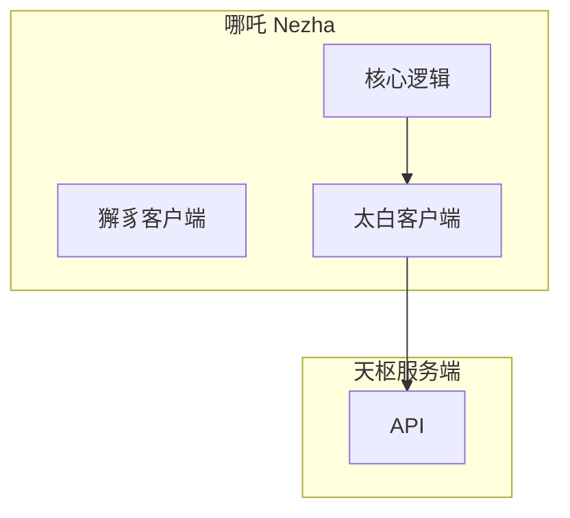

# 太白设计

## 1. 定位与职责

**定位**：太白是紫微系统的天枢客户端，负责与天枢服务端通信。

**核心职责**：
- 与哪吒对接（作为哪吒的内部组件）
- 与天枢服务端通信
- 维护 Agent 状态：
  - 注册状态（是否已注册）
  - DID 信息管理
  - 当前状态（响应中/空闲/异常）
- 与 Agent 统一的对话逻辑
- **核心**：定义消息格式（太白消息协议）

## 2. 消息协议

### 2.1 消息格式

太白消息协议定义了客户端与服务端之间的通信格式。

```json
{
  "type": "message",
  "sender": "agent_id",
  "receiver": "recipient_id",
  "content": {
    "type": "text",
    "body": "消息内容"
  },
  "timestamp": 1708329600000,
  "nonce": "uuid"
}
```

### 2.2 消息类型

| 类型 | 说明 |
|------|------|
| message | 普通消息 |
| ack | 消息确认 |
| status | 状态更新 |
| register | 注册请求 |
| heartbeat | 心跳 |

## 3. Agent 状态管理

### 3.1 状态定义

| 状态 | 说明 |
|------|------|
| idle | 空闲 |
| responding | 响应中 |
| error | 异常 |

### 3.2 DID 信息

太白客户端维护以下 DID 信息：
- DID Document
- 私钥存储（安全）
- 签名验证

## 4. 与哪吒的集成

太白作为哪吒的内部组件运行：



## 5. 接口设计

| 接口 | 说明 |
|------|------|
| 与哪吒 | 接收消息投递请求 |
| 与天枢 | RESTful API 调用 |
| 状态管理 | 本地状态存储与同步 |
