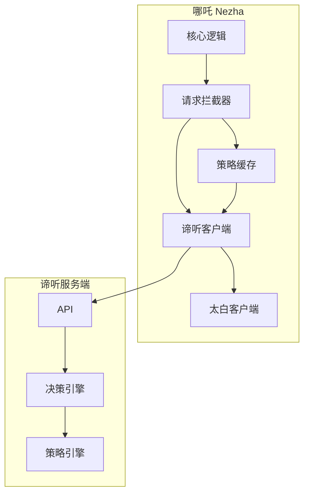
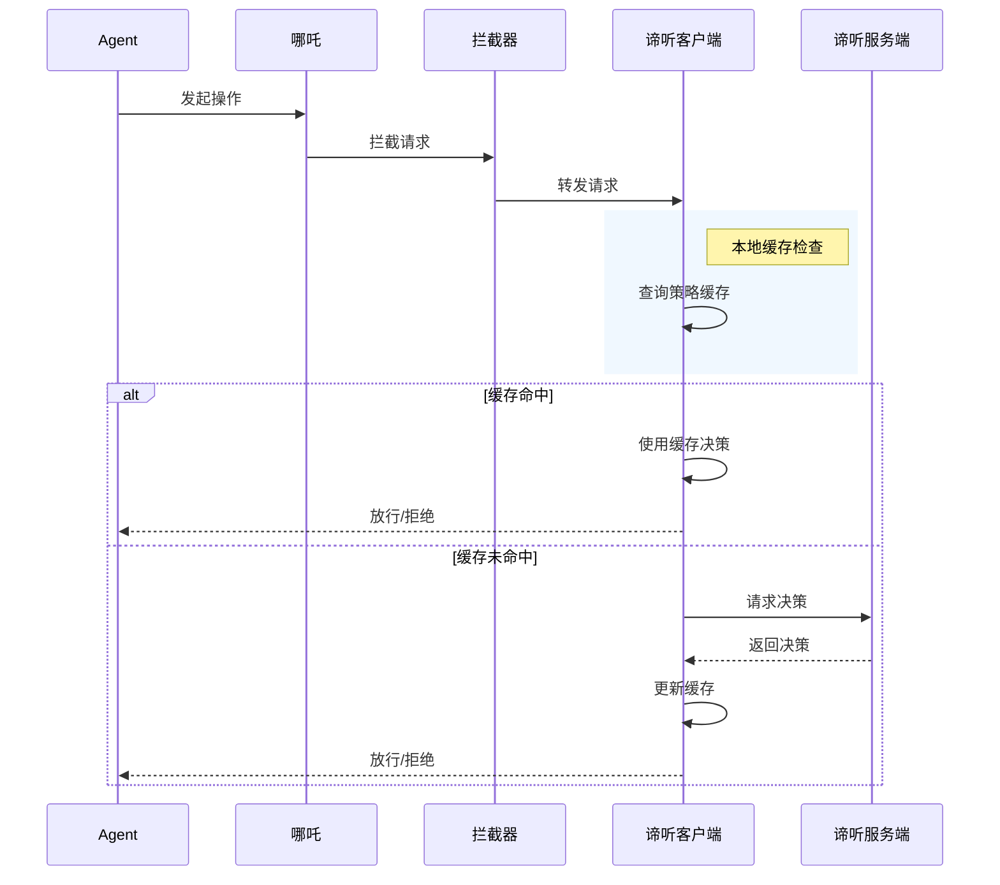

# 谛听客户端详细设计

## 1. 定位与职责

**定位**：谛听是紫微系统下的独立子项目，谛听客户端集成在哪吒内部，负责拦截操作请求并与谛听服务端通信。

**核心职责**：
- 拦截哪吒内的所有操作请求
- 本地策略评估与缓存
- 与谛听服务端通信
- 执行策略决策

## 2. 架构图

## 3. 核心功能模块

| 模块 | 功能描述 |
|------|----------|
| 请求拦截器 | 拦截所有操作请求 |
| 策略缓存 | 本地缓存审批规则和安全策略 |
| 服务端通信 | 与谛听服务端 HTTP/gRPC 通信 |
| 决策执行 | 执行放行/拒绝/审批请求 |

## 4. 工作流程时序图

## 5. 接口设计

| 接口 | 说明 |
|------|------|
| `/decide` | 请求策略决策 |
| `/sync` | 同步策略更新 |
| `/report` | 上报执行结果 |
